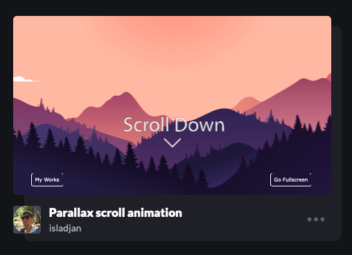

# Tony's Code Journal
Learnings, reminders and frustrations written in the moment.

---

## July 17, 2022
With the BT launch coming close, thoughts are beginning to turn to board game mechanics to help fill out the programming with game theory. This video on the "[I cut, you choose](https://www.youtube.com/watch?v=pa52DqBfYlM)" mechanic references a great directory of board game mechanics, along with references to the games that use them:
- [Board Game Mechanics](https://boardgamegeek.com/browse/boardgamemechanic)

---

## July 16th, 2022
**Research**: Card designs for blog and article posts.
- [Card UI Examples and Best Practices for Product Owners](https://www.eleken.co/blog-posts/card-ui-examples-and-best-practices-for-product-owners)
- [Designing cards](https://uxdesign.cc/designing-cards-for-beginners-9ed9454d27f6)
- [Material UI: Cards](https://material.io/components/cards)
    - Excellent summary of basic card pattern best practices.

### Card Mood Board
<br>
Example card diagram from the [Material Design docs](https://material.io/components/cards).

<br>
Yet another example card diagram from the [Material Design docs](https://material.io/components/cards).

<br>
CSS Tricks card example.

<br>
CSS Tricks card example with generic image.

<br>
Codepen card example.

<br>
Twitch card example.

---

## July 16th, 2022
I've been knocking down some BT cards this afternoon and now have to do a tricky one: adding a Twitch link to the main nav.
- Problem: the SK theme I'm using only supports one type of nav link. Baiscally, I need to either add of fake a new Utility nav bar.
- Solution: figure out how to add an additional class to each link so I can style the Twitch item with the logo and matching coloured background.
    - The theme already supports `active` links using `class`. Otherwise `class` is empty. Now I just need to figure out how this Svelte syntax works:
        ```js
        <a
          href={href}
          on:click={maybeCloseMenu}
          class:active={isCurrentPage}
          aria-current={isCurrentPage ? 'page' : false}
        >
        ```
        - Specifically, how do I add classes to `class:active={isCurrentPage}`?
    - Svelte's terminology for this is "[class directive](https://svelte.dev/tutorial/classes)"
    - Aaaand Svelte wins again. I can just add a separate class directive and Svelte will chain them automatically:
        ```js
        <a
          href={href}
          on:click={maybeCloseMenu}
          class={page}
          class:active={isCurrentPage}
          aria-current={isCurrentPage ? 'page' : false}
        >
        ```
        - I had to make some other changes to gain access to the `page` value but it was pretty straight forward.

---

## July 14, 2022
I finally committed to streaming every Saturday at noon by setting up a repeating event in my Twitch Schedule! I don't want to do the Dice topics on short notice for this weekend so I'm going to try building a cross-fade slider thingy that compares JWST and Hubble images:
- [Example WebbCompare app](https://johnedchristensen.github.io/WebbCompare/Southern_Nebula.html) by John Christensen
    - [Source code](https://github.com/JohnEdChristensen/WebbCompare)
    - Originally referenced by [Joe Scott](https://youtu.be/UGK5eIuWxb4?t=882)
- [Related Reddit thread](https://www.reddit.com/r/gifs/comments/vwyx4h/comment/iftqfoj/)
- TODO: Find new images from recently released (today, supposedly) images used for commissioning the telescope.


---

## July 12, 2022
Currently trying to get the marketing side of BT online. I've still got the BT MailChimp account from the original sessions I did a few years ago. Copy and pasting the embed code from the admin panel doesn't work with SvelteKit, though.

I found this article with sample code that might be useful:
- Article: [Build your own SvelteKit Boilerplate: Using Mailchimp with Endpoints](https://elliscs.hashnode.dev/build-your-own-sveltekit-boilerplate-using-mailchimp-with-endpoints) with [YouTube video](https://www.youtube.com/watch?v=6qYuYTeocQU)
- Repo: [csellis/svelte-backpack](https://github.com/csellis/svelte-backpack)
- Ugh, the docs and interface of MailChimp is a pain. Currently evaluating SendinBlue as an alternative. So far so good...
    - TODO: Setup a reCAPTCHA account for the hosted sign-up form.

---

## July 10, 2022
- TODO: Breakdown [Board Game Design and the Psychology of Loss Aversion](https://www.youtube.com/watch?v=F_1YcCcBVfY)
    - Lots of theory and examples of how to use loss aversion to make your games better.
    - A book referenced in the talk: [Thinking, Fast and Slow](https://www.goodreads.com/book/show/11468377-thinking-fast-and-slow) by Dan Kahneman

---

## July 6, 2022
**Session goal**: [Feature: Dark mode](https://github.com/browsertherapy/browsertherapy-v2/issues/8) cont'd

Getting back to the Dark Mode toggle, I'm unsure if a store is needed? It feels like this can be done with CSS Variables and a data attribute. Normally I'd take the time to figure it out myself but I think I'll cheat and take a look at Josh's implementation on his live blog. It doesn't respect the system preference but I'll figure that out later.
- He's using stores and setting the mode with classes. I'll eventually use data attributes, I think? I'm not sure why but it just seems cleaner.
- That said, I'm putting the Dark Mode toggle on the shelf for now; re-designing the default theme will be enough work without needing to think about another theme. BUT, I look forward to setting new colours for the logo when it comes to it.

**Session Goal**: [Refactor banner](https://github.com/browsertherapy/browsertherapy-v2/issues/9)
- Time to finally do some "design"! [I did a mood board](https://acidtone.github.io/code-journal/#april-10-2022) back in April that I can now use to properly rip off other designers.
- That said, I'm going to go with the traditional left/right logo/nav layout for the banner. It works and this isn't a portfolio site.

---

## July 4, 2022
Been thinking about why Browser Therapy exists. Not only why someone would want to watch a stream but what it means to me and why I'm doing this in the first place.

### Why Browser Therapy?
1. **Code craft**: Proceed with the indent of mastering your craft. Seek challenges and find progressively more difficult problems with code.
2. **Accountability**: Commit to the journey, set some goals and share your progress with others.
3. **Escape**: Code isn't just about work. It can also be a tool of self-expression but the journey doesn't have to be fun.

These are not prescriptive but are core principles to direct me when I get distracted.

---

## June 30, 2022
**Session goal**: [Feature: Dark mode](https://github.com/browsertherapy/browsertherapy-v2/issues/8)

**Plan**: 
1. Try implementing the [Ultimate Dark mode toggle](https://padlet.com/acidtone/UltimateDarkModeToggle) exercise in SvelteKit.
2. Compare the implementation with the one Josh uses on [his personal blog](https://joshcollinsworth.com/)
    - Note: This implementation doesn't respect system dark mode preference.

**Brute force notes**:
- First of all, coming back to this after a year tells me I need to write a step-by-step of my final solution:
    1. Add HTML for toggle:
        ```html
        <!--Will add toggle switch here-->
        <div class="theme-switch-wrapper">
            <label class="theme-switch" for="checkbox">
                <input type="checkbox" id="checkbox" />
                <div class="slider round"></div>
            </label>
            <em>Enable Dark Mode!</em>
        </div>
        ```
    2. Add the CSS:
        ```css
        .theme-switch-wrapper {
            display: flex;
            align-items: center;
        }

        .theme-switch-wrapper em {
            margin-left: 10px;
            font-size: 1rem;
        }

        .theme-switch {
            display: inline-block;
            height: 34px;
            position: relative;
            width: 60px;
        }

        .theme-switch input {
            display:none;
        }

        .slider {
            background-color: #ccc;
            bottom: 0;
            cursor: pointer;
            left: 0;
            position: absolute;
            right: 0;
            top: 0;
            transition: .4s;
        }

        .slider:before {
            background-color: #fff;
            bottom: 4px;
            content: "";
            height: 26px;
            left: 4px;
            position: absolute;
            transition: .4s;
            width: 26px;
        }

        input:checked + .slider {
            background-color: #66bb6a;
        }

        input:checked + .slider:before {
            transform: translateX(26px);
        }


        .slider.round {
            border-radius: 34px;
        }

        .slider.round:before {
            border-radius: 50%;
        }
        ```
    3. Add the JS. This might take some refactoring. Josh [used stores for some things](https://github.com/josh-collinsworth/sveltekit-blog-starter/blob/main/src/lib/assets/js/store.js) and it feels like it's a good way of handling state.
        - Luckily, there's a [decent tutorial on stores](https://svelte.dev/tutorial/writable-stores) in the Svelte docs.

---

## June 29, 2022
Next TODOs for BT blog:
- ~`h2`-`h6` is showing body text font -> accent font~
    - [posted an issue](https://github.com/josh-collinsworth/sveltekit-blog-starter/issues/7) for Josh's theme
- ~`.site-title` is using accent font -> code font?~
- Refactor [Ultimate Dark Mode Toggle](https://padlet.com/acidtone/UltimateDarkModeToggle) for this theme.

Updated [bt-v2 Project board](https://github.com/orgs/browsertherapy/projects/1). I had to delete most of the existing cards that were attached to the previous version of the site (before I adopted the theme).
- Interestingly, there doesn't seem to be a way to directly link to individual cards/items in the project?

### Convergent BTv2 Build Session
**Goals:**
Copy/pasted from [GH Project](https://github.com/orgs/browsertherapy/projects/1):
- Add markdown test page
- Install remark-containers
- Install remark-attr
- Install remark-deflist

**Brute force notes**
- Made a [gist for extended syntax test page](https://gist.github.com/acidtone/80ccaf03bf2e50de20428474f8a7f196).
    - `remark-attr` syntax causes a compile error in mdsvex.
- Process for installing `remark` plugins under `mdsvex` 
    1. Confirm the npm package names:
        - [remark-deflist](https://www.npmjs.com/package/remark-deflist)
        - [remark-containers](https://www.npmjs.com/package/remark-containers)
        - [remark-attr](https://www.npmjs.com/package/remark-attr)
    2. Install packages:
        ```bash
        npm i -D remark-attr remark-containers remark-deflist
        ```
    2. Import packages:
        ```js
        // svelte.config.js
        import attr from "remark-attr"
        import containers from "remark-containers"
        import defList from "remark-deflist"
        ```
    3. Add to `svelte.config.js`
        ```js
        // svelte.config.js
        remarkPlugins: [
            defList,
            containers,
            attr
        ],
        ```
- Bonus: close the issues from the command line to watch the Project cards magically move from In Progress to Done!
    ```bash
    git commit -m "Closes #1, closes #3, closes #4, closes #5"
    ```


---

## June 28, 2022
**Research**: for potential stream topics
- [Flip animations | HTTP 203](https://www.youtube.com/watch?v=8q_05PUYv1o)
- [Bezier Curves](https://www.youtube.com/watch?v=enNfb6p3j_g) by the Coding Train

---

## June 26, 2022
### Live Stream Agenda
1. Add noise suppression ([full notes](https://acidtone.github.io/teaching-journal/breakdowns/twitch-sound-filters.html))
    1. Click cog next to the sound source -> Filters
    2. Click `+` to add filter
    3. Select `Noise Suppression` -> Custom name -> OK
    4. Tweak Level. Try -20dB?
2. Add Featured Chat
    - [full notes](https://acidtone.github.io/teaching-journal/breakdowns/twitch-featured-chat.html)
3. Try adding a countdown timer?
    - Try installing [Stream Countdown Timer](https://apps.elgato.com/plugins/com.barraider.streamcountdowntimer) Stream Deck plugin even though it doesn't list Mac in the requirements.
4. Project workspace setup
    - Clone some repos!
        - Hello world
            - [sveltekit-blog-starter](https://github.com/josh-collinsworth/sveltekit-blog-starter/)
            - [joco-sveltekit](https://github.com/josh-collinsworth/joco-sveltekit)
        - BT Websites
            - [browsertherapy-v2](https://github.com/browsertherapy/browsertherapy-v2)
            - [browsertherapy.github.io](https://github.com/browsertherapy/browsertherapy.github.io)
        - Journals
            - [code-journal](https://github.com/acidtone/code-journal)
            - [teaching-journal](https://github.com/acidtone/teaching-journal)
        - Maybe some others

### SvelteKit Starter Theme customization
**Attribution**: Josh Collinsworth's excellent [sveltekit-blog-starter](https://github.com/josh-collinsworth/sveltekit-blog-starter/) theme.

My steps for customizing the theme in case I have to do it again (like for my personal blog):
1. Update [`/lib/config.js`](https://github.com/josh-collinsworth/sveltekit-blog-starter/blob/main/src/lib/config.js);
2. Replace fonts:
    - Font values are stored as [CSS Variables in SCSS](https://github.com/josh-collinsworth/sveltekit-blog-starter/blob/main/src/lib/assets/scss/_vars.scss):

        ```css
        /* /lib/assets/scss/_vars.scss */
        --accentFont: 'Libre Franklin', Georgia, Times, serif; 
        --primaryFont: 'Libre Franklin', sans-serif;
        --codeFont: 'Fira Code', monospace;
        ```

    - And the fonts, themselves, are imported directly in [`/src/app.html`](https://github.com/browsertherapy/browsertherapy-v2/blob/main/src/app.html)

        ```html
        <link href="https://fonts.googleapis.com/css2?family=Libre+Franklin:ital,wght@0,400;0,800;1,400;1,800&display=swap" rel="stylesheet">
        ```

        I would rather use Amaranth for the Heading font and Open Sans for body text. I'll need to do some leg work to figure out which styles and weights I need for the default styles to work properly. In this case it looks like I'll need `400` and `800` weights for both regular and italic? 
        
        It's also the same for both accent and body fonts.

    - TODO: Figure out what the performance hit is for downloading normal and bold weights for two different accent and body text fonts. Does SvelteKit have a magic way of loading them performantly? Is it too soon to bother with Variable Fonts?
    - Draft font set:
        - Accent
            - [Amaranth](https://fonts.google.com/specimen/Amaranth)
                - Regular 400
        - Body text
            - [Open Sans](https://fonts.google.com/specimen/Open+Sans)
                - Light 400 with Italic
                - SemiBold 700 with Italic
        - code
            - [Fira Code](https://fonts.google.com/specimen/Fira+Code)
                - Regular 400
        - HTML import
            ```html
            <link rel="preconnect" href="https://fonts.googleapis.com">

            <link rel="preconnect" href="https://fonts.gstatic.com" crossorigin>
                
            <link href="https://fonts.googleapis.com/css2?family=Amaranth&family=Fira+Code&family=Open+Sans:ital,wght@0,400;0,700;1,400;1,700&display=swap" rel="stylesheet"> 
            ```

    - Are italic font sets needed? What's their impact on performance?
    - TODO
        - `h2`-`h6` is showing body text font -> accent font
        - `.site-title` is using accent font -> code font?
3. Update colours
    - hex colours but nicely defined:
        ```css
        :root {
            // Colors
            --accent: #E63946;
            --background: #FAF9F8;
            --lightAccent: #A8DAE5;
            --lighterAccent: #E6E8E4;
            --dark: #457B9D;
            --darker: #1D3557;
            --slate: #2F3948;

            --white: #fff;
            --black: #152030;

            --ink: var(--slate);
            --paper: var(--background);
        }
        ```
    - Some options for a new colour theme:
        - convert `hex` into `hsl`
        - use a pallet from a movie/image/art screencap?
    - Dark mode
        - I _love_ the use of `--ink` and `--paper` CSS variables.
        - TODO: Refactor [Ultimate Dark Mode Toggle](https://padlet.com/acidtone/UltimateDarkModeToggle) for this theme.
4. Update Prism theme?
    - `$lib/assets/scss/_prism.scss`
    - How can this be changed? To what?

## Live Stream Notes
- Audio is still present in OBS if the gain on the Scarlett is turned completely down. Probably due to the boosted gain setting.
- Highlights
    - @20:50 - Noise Suppression filter (RNNoise)
    - @29:33 - Successful featured chat!

---

## June 25, 2022
I spent a good part of the afternoon adding a dynamic route for single posts stored behind a hidden directory. Also, a post with a file name of `/2022-06-23-how-to-function` would have a URL endpoint of `/how-to-function`. That way I can order my content by date and not have the date pollute my URLs.

But, that's just one victory in my journey toward a fully functioning blog for BT and there's still a long way to go. That's why I'm going to, instead, start over using Josh Collinsworth's [sveltekit-blog-starter](https://github.com/josh-collinsworth/sveltekit-blog-starter/) as a starting point.

It seems to have a lot of the fine points taken care of (like 404s and 500s) and it's minimal enough to build upon. First up: add the date stuff in the first paragraph above...


---

## June 24, 2022
Oh day of days! [Josh Collinsworth](https://joshcollinsworth.com/) replied to my email about his article! He pointed me to two of his repos that apparently do the things:
- [His blog](https://github.com/josh-collinsworth/joco-sveltekit)
- [SvelteKit starter](https://github.com/josh-collinsworth/sveltekit-blog-starter) that he uses for his blog

### The Magical `import()` function
And it looks like this mysterious `import()` function is what I've been looking for. It's deceptively hard to find documentation on this function. Josh's (we're on a first-name basis, whatevs) article uses `import.meta.glob()`, which is great for pulling front matter from markdown, but I'd love to find an article/doc/whatevs giving me the low-down on this, like:
- Is it a Vite object? It feels like it.
- How does it interact with SvelteKit? 
    - Is it the reason my code doesn't work with Page Endpoints?
    - Is it compatible with SSG?
- What's the most performant way to full a full directory of markdown files?
- Does it work asynchronously?

---

## June 23, 2022
**Session goal**: load markdown files from a hidden directory
The more I dig into this whole hidden directory requirement for the BT blog, I wonder why they need to be hidden in the first place. It would be much simpler to just dump all these posts in a `blog` directory and be done with it.

But then I remember that I want to name my files with the date prepended to the title and then have the slug just be the "title" without the the date. It also be nice to be able to add an optional slug to the front matter of a post to override the whole system.

All great ideas (maybe?) but the rabbit hole is beckoning. Back to Brute Force guidelines: **get the basics working first** and worry about the fancy shit later.

**Brute force**
- I've been searching for ways to import individual posts and [the same blog article](https://joshcollinsworth.com/blog/build-static-sveltekit-markdown-blog) I've been using keeps coming up. I even sent him a message from his website contact form asking if I'm on the right track.
- Current theory: the best way to handle this is to setup an additional `/posts/[slug].json` endpoint and handle it with another `load()` just like the list entry endpoint. From there I can add any logic I need once I get a base `[slug]` endpoint working.
- Ugh, I just realized that `import.meta.glob()` only imports the front matter of md files. It seems obvious now that I think about it. 
- After some research it looks like [the answer may lie in the `mdsvex` component](https://github.com/pngwn/MDsveX/issues/247). Based on this issue, it looks like `pngwn` is pretty responsive and the poster of this issue had his documentation PR accepted!
- After much research and failed attempts, it's very difficult to dynamically import a markdown file as a component due to limitations with the bundler. It makes sense now that I think about it: the bundler doesn't know the path at compile time because it's a "runtime" kind of situation. 
- Moving back to endpoints. First obstacle: is there a way to import the whole file and not just the meta data? Worst case, I guess I could try a basic readfile-type function.
- I found two very intriguing videos on markdown blogs in sveltekit:
    - [SvelteKit with MDsveX and Auto-Import of Svelte Components](https://www.youtube.com/watch?v=F_WC4UxStvs)
        - [Source code](https://gitlab.com/bwklein/theme-demo)
        - The code is pretty busy but mature!
        - TODO: teardown
    - [Building a blog with SvelteKit, TailwindCSS, and MDsveX](https://www.youtube.com/watch?v=U5bMAW7SINM) by Jeffrey Pohlmeyer
        - [Companion article](https://jeffpohlmeyer.com/building-a-blog-with-sveltekit-tailwindcss-and-mdsvex) 
        - [Source code](https://github.com/jvp-design/sveltekit-tailwind-mdsvex-blog)
        - [Part 2: Adding Styling, Searching, Custom Components](https://www.youtube.com/watch?v=-OSTAkjGVng)
        - TODO: walk-through

---

## June 21, 2022
Research for the next couple meta Twitch sessions to figure out:
- Blog
    - how to load markdown files in a hidden directory
        - [How to use [slug] (dynamic routes) in Svelte and SvelteKit](https://www.programmingtil.com/contents/how-to-use-slug-dynamic-routes-in-svelte-and-sveltekit) by David W Parker
            - This one is from April 2021 so might be a bit out of date...
- OBS/Twitch
    - Adding a sound gate to OBS to cut out the hvac from the lav mic
        - [OBS Studio - Advanced Mic Settings (Noise Removal, Compressor, Noise Gate)](https://www.youtube.com/watch?v=noqKxopwp74) by Gaming Careers
            - Good summary of sound filters. I'll probably just need a Noise Suppressor? The others seem more for gaming.
            - Would a gain filter be better than what I did last stream by using `Edit > Advanced Audio Settings` for boosting volume?  
    - How to display individual Twitch comments on screen in OBS
        - [How To Show Chat Messages On Stream](https://www.youtube.com/watch?v=OK1V_7CmyfY) by Gaming Careers
            - Sponsor: Epidemic Sound - royalty-free music for streams
            - Covers "Featured Chat" that should be able to handle everything I need! It uses a third-party platform that I can include in OBS using a web source.

I think I already found the answers to my questions but Gaming Careers has a lot of other great videos:
- [7 Free Tools to IMPROVE Your Twitch Stream](https://www.youtube.com/watch?v=EFTT2tZhAKk)
    1. [VDOninja](https://vdo.ninja): I think this is what other streamers use to show video/audio of guests?
    2. [Media Looper](https://nerdordie.com/product/media-looper-loop-videos-and-images-on-stream/)
    3. [Crossclip](https://crossclip.com/)
    4. [Twitch Creator Goals](https://help.twitch.tv/s/article/creator-goals)
    5. [Triggerfyre](https://overlays.thefyrewire.com/widgets/triggerfyre/)
    6. [Free Webcam Masks](https://nerdordie.com/product/free-webcam-masks/)
    7. [NOOBS CMDR](https://github.com/nuttylmao/NOOBS-CMDR/releases)
- [Upgrade Your Stream Deck: 9 Advanced Tips For Streamers](https://www.youtube.com/watch?v=HA7tA4lRBpE)
    - It details lots of cool tips but I have a feeling they only work on PC :(
    - But there's:
        - [Countdown Timers and Counters](https://www.youtube.com/watch?v=HA7tA4lRBpE&t=374s)
        - [Webcam Settings Restore](https://www.youtube.com/watch?v=HA7tA4lRBpE&t=556s): for when OBS forgets my cam settings
        - There are more that look awesome but I don't think I need them (yet).
- [How To Make a CUSTOM Stinger Transition WITH Track Matte](https://www.youtube.com/watch?v=wCovjpmRbTE)
    - This is pretty involved and uses Adobe After Effects. BUT, I admit this would be cool to implement. Basically, OBS bow natively supports a "track matte" that let's you do all the things when transitioning between scenes.

---

## June 19, 2022
Software install list for M1 Mac Mini initial setup:
- iTerm -> Oh My Zsh!
    - `ZSH_THEME="gozilla"`
- homebrew
    - Git (double-click installer)
        - [First-time setup](https://gist.github.com/acidtone/6ca4c62d88570732d3760904ef965e4d)
        - [Setup SSH Keys](https://gist.github.com/acidtone/dd9ae11a238e9f14ad0b066298f35dc5)
    - nvm
- VS Code
    - Live Server
    - [Code Spell Checker](https://marketplace.visualstudio.com/items?itemName=streetsidesoftware.code-spell-checker)
    - [GistPad](https://marketplace.visualstudio.com/items?itemName=vsls-contrib.gistfs)
- Zoom
- Discord
- Rectangle

---

## June 18, 2022
Session goals:
1. TODOs from yesterday: Remove extraneous category endpoints.
2. Clean up nav so they don't link to the old category links. 
3. Maybe remove the whole nav and replace with Home and About (stream schedule, rehash of the Twitch description)?
4. Add post item pages for the blog.
5. Write out a session plan for the stream tomorrow.

**Brute force**:
- Nav and post category cleanup has been pretty straight forward but the post item links are still broken. 
- Going to try building a dynamic endpoint for `/blog/slug`, which will pull content from the hidden `/_posts` directory.
    - How should slugs work? 
        - Auto-generate from the title?
        - Include the date?
        - Will the format change based on category?

---

## June 16, 2022
The streaming rig is physically set up and I'm ready to start testing some Twitch streams. Anything I do live should have a session plan that viewers can reference so I guess it's time to get back to the Browser Therapy blog/website.

**Goal**: Implement list entry and item pages for Articles, Guides and Challenges so I can write out a plan for the first Twitch test (which will probably be setting up initial software).

**Plan**:
- Follow [my fave SvelteKit blog tutorial](https://joshcollinsworth.com/blog/build-static-sveltekit-markdown-blog)
- Question: 
    - Should all posts be in the same folder with `category` properties in the front matter?
    - How to title posts? Date with title? Should dates be used at all in the title?

**Brute force**:
- It's been awhile since I've worked on this repo. Almost scared to update the SK version. It's currently at `next.345`.
- There are a couple breaking changes between `next.345` and `next.350` but I don't think I need to worry about them.
- I'm tempted to only update SK but it's probably best to do a full `npm update`?
    ```
    added 98 packages, removed 2 packages, changed 36 packages, and audited 246 packages in 2m
    ```
    - And everything still works. What a whole lotta nothing.
- [list entry pages](https://github.com/browsertherapy/browsertherapy.com/commit/197b5257c5423b9dd441f2169b7eb3fd6fe89dd8) are added.
    
**Walkthrough**:
- The list entry pages seem a little clunky. I ended up just copy/pasting the code across the three directories for guides, challenges and articles.
- My gut tells me that it's a better idea to put all the posts in one directory and create hard-coded routes for the three categories of posts.

**Optimization**:
- Following the [instructions for dynamic categories](https://joshcollinsworth.com/blog/build-static-sveltekit-markdown-blog#add-dynamic-post-category-pages) but without the dynamic bits.
- Ended up grouping all the posts into a single directory. I had to add some filter logic to the new endpoint but it all seems to be working. Problem: I had to put all the posts into a hidden `_posts` directory so I'll need to figure out how and where I want the posts to exist by adding a dynamic route.
- TODO: Create a dynamic route(s) for individual posts.
    - Assumption: it's better to route all posts through a single endpoint will be better for seo?
        ```
        tld/[slug]
        ```
        or, to make route logic simpler by dedicating a segment for them:
        ```
        tld/posts/[slug]
        ```
- TODO: ~Remove extraneous category endpoints. There's not enough content to require categories.~
- Todo: Dedicate to a migration schedule - wbdv content -> posts
    - what content should be dated as posts?
    - what content is better as static content?
    - what's the learning goal(s)? 

---

## June 3, 2022
Bubbles sent me this sveltekit component for flow diagrams:
- [svelvet.io](https://svelvet.io/)

**Story**: As a game designer, I want to post a state diagram in the browser so that I can share/record game ideas.
- See: [Github Project](https://github.com/browsertherapy/browsertherapy.com/issues/18)

**Session Goal**:
- Install hello-svelvet

**Plan**:
1. Use [Create SvelteKit skeleton app](https://gist.github.com/acidtone/a663a359182fd6d3025adb4445a83934) gist to boot up a quick project.
2. Use the [Svelvet Docs](https://svelvet.io/docs) to [install](https://svelvet.io/docs/installation/)
3. Add a component that describes the latest draft of the King of Tokyo state diagram:


**Brute force**
- Made [this Gist](https://gist.github.com/acidtone/a663a359182fd6d3025adb4445a83934) because I've been making a lot of SveltKit apps from scratch lately.
- Copied demo code from [Svelvet Basic Usage](https://svelvet.io/docs/basic-usage/) page.
    - and it just works!
- Buuuuut, the functionality is pretty limited:
    - The entire diagram needs to be manually positioned? Although you can drag nodes and re-position, there's no way to save the new positions. 
    - Looks like edge anchor locations are hard coded for the top and bottom. That's pretty limiting.
    - I got a rudimentary state diagram working but it took a lot more work than it needed to. Ended up having to inspect all the nodes each time I moved them so I could copy the new coords to the static definition.
        
- Conclusion: It's a neat proof of concept but I'd need a really good reason to build diagrams in SvelteKit. Even the most basic general diagram tool will beat this.

**Deploying SK to GH Pages**
Deploying this code isn't needed but my last attempt at deploying SvelteKit to GitHub Pages failed miserably so I'll give it another shot and send my diagram to Bubbles.
- [This article didn't work](https://javascript.plainenglish.io/sveltekit-github-pages-4fe2844773de) using a `gh-pages` branch.
- New article: [How to Deploy SvelteKit Apps to Github Pages](https://sveltesaas.com/articles/sveltekit-github-pages-guide/) using the `/docs` directory.
    - And I get a [404 error](https://acidtone.github.io/svelvet-state-diagram/). That's disappointing :(

---

## May 28, 2022
Having a coding session at PinBar with Ash. I'd love, love, love to keep working on the dice tower but I've had the markdown blog project sitting on the shelf for too long. It'll probably take a half-hour just to get back up to speed on where I left off?

Update: [chased a routing error](https://github.com/sveltejs/kit/discussions/4977#discussioncomment-2842318)
- TODO: repost as a new discussion.

---

## May 26, 2022
I wanted to work on some design aspects but I forgot I fell asleep coding a couple days ago. It took awhile to remember what I was in the middle of, but I managed to figure it out and clean up the code to [a working state](https://github.com/acidtone/dice-tower-vanilla/commit/59e5e720fd17c0684221d7632b42e6ca5366f92d).

It's now overtime for Game 5 against the Oilers. Not sure how much work I'll get done tonight... and they lost.

**BUT!** The refactor made support for multiple RPG-style dice notation [relatively easy](https://github.com/acidtone/dice-tower-vanilla/commit/b995f8ae434feef5715be7bdb5fd49274e6b07fa).

---

## May 24, 2022
Eureka! I think I figured out a way to clean up the dice tower API. D&D has a notation for rolling dice:
- `2d6`: two 6-sided dice
- `d8`: one 8-sided die
- etc

So, I can use data types for recognizing what to roll and how many:
- integer: shorthand for one numeric die
    - `6`: 6-sided die
    - `5`: invalid die (according to my rules)
- string in `xdy` format: roll `x` number of `y`-sided dice
    - `2d10`: roll two 10-sided die
- string in `dy` format: one `y`-sided die
    - d20: one 10-sided die
- array of strings (not in `xdy` format): one custom die
    - could also be an array of objects if there's an advantage to including more info on the custom faces.

**Session goal**: refactor last night's code to use strings in `xdy` format.
- keep it simple: `arg` is just one string. Leave multiple sets of dice for later.
- keep current integer shortcut for simple die

**Plan**
- use regex to split string, `return null` if pattern does not match.
- is it worth literally building arrays for each die or just return the random integer? nah.

**Brute force**
- regex is a blast from the past. After a refresh, it doesn't look like there are many differences from my Perl days.
    - `\d` for digits
    - `^` and `$` for the start and end of the string
    - `*` for zero or more matches
- to keep things simple I'll match all potential sides of dice and filter out non-isohedrals later.
    - matching on `/^(\d*)d(\d+)$/` seems to work!
        - `2d10` -> `[ "2d10", "2", "10" ]`
        - `d6` -> `[ "d6", "", "6" ]`
- Aaaand [done](https://github.com/acidtone/dice-tower-vanilla/commit/5a8d81312fe89043549bb9d05cffae7bdd8a280c)!

**Usage**
- Pass an isohedral integer `x` to `drop()` an `x`-sided die.
    - `6` -> random `[1-6]`
    - `5` -> `null` (not a valid die; not isohedral)
- Pass an `Array` of isohedral integers `n` to roll and sum each `n`-sided die
    - `[4,6,10]` -> random `[3-20]`
    - `[4,5,10]` -> random `[2-14]` because `5` is not valid
- Pass a string that matches rpg die notation to roll a set of like-sided dice. RegExp -> `/^(\d*)d(\d+)$/`
    - `2d6` -> random `[2-12]`
    - `d4` -> random `[1-4]`
    - `2dTwenty` -> `null`

**Walk-through**
- TODO: Add support for an array of rpg strings!
- ~TODO~: Print sum to the page
- ~TODO~: Add form for adding a text field for `arg`
- TODO: Add support for verbose results and `return` an object instead of an integer.
- ~TODO~: Move duplicate code to a `isIsohedral()` function.
    ```js
    !allowedFaces.includes(parseInt(notationMatch[2]))
    ```
- ~TODO~: Move duplicate code to a `randDieFace(faces)` when `faces` is an integer.
    ```js
    Math.floor(Math.random() * faces) + 1
    ```
- Question: better to use `Math.ceil()` instead of adding `1`?

[TODOs added to code](https://github.com/acidtone/dice-tower-vanilla/commit/2cc8b7d9cef1659410c3f661195f0ccf0fdb030e)

**Optimization**
- `randomDieFace(faces)` and `isIsohedral()` are probably a good place to clean things up.
    - And [done](https://github.com/acidtone/dice-tower-vanilla/commit/3df500b070954c9ad54259feb9877b80221fca54).

**Reflection**
I'm now at point in the project where I could go in a couple directions: wide or deep.
1. Add support for multiple sets of rpg notation, OR
2. Add support for verbose results, OR
3. Add a form for input and print results to the page. 

It think #3 increases the value of #1 and #2.

**Goals**: 
- TODO: Add form for adding a text field for `arg`
- TODO: Print sum to the page

**Brute force**
- When it rains regex, it pours! I thought turning a comma and/or space delimited text field would be hard to dynamically turn into an array but `String.split(/[, ]+/)` did the trick.
    - [added form input and html result](https://github.com/acidtone/dice-tower-vanilla/commit/21c89ffa4e8df6d24a81a2a562a38d7d52f7c4ab)

---

## May 23, 2022
First step toward Calgary Coup: the dice roller. I did some research into the `svelte-fsm` package and it looks great for the larger application. The dice roller, however, doesn't need states. In fact, it should probably just be a pure function.

- The two "axis" of logic (there's a better term for that?) are:
    - is there just one die or multiple dice?
    - is each die basic (faces are sequential numbers starting at 1) or custom (faces can be anything)


### Dice rollers are not trivial
I've created a dice tower function that supports single and multiple numeric dice. It wasn't too bad but a lot of energy had to be spent properly scoping the session. Limiting the scope to numeric dice was the key in avoiding rabbit holes.

Given:

```js
roll(arg);
```

So far the `roll()` will:
- `return null` when `arg` is not an integer or non-empty array
- `return null` when `arg` is a [non-isohedral](https://en.wikipedia.org/wiki/Isohedral_figure) integer
- if arg is integer (a die): treat `arg` as a `arg`-sided die and `return` a random integer between 1 and `arg` (the roll result)
- if `arg` is array of integers (a hand of dice): treat `arg` as an array of `arg[i]`-sided dice and `return` the sum of random results from each die roll.
    - if `arg[i]` is not an integer, it is ignored in the sum

**Walk-through**
- TODOs: add support for single custom die
    - array of strings or objects?
- TODO: add support for many custom dice
    - is a sum needed?
    - what is returned? an array of results?

---

## May 21, 2022
New working title for the game inspired by King of Tokyo/New York: Calgary Coup. It might change later?

Up until recently I was planning on building the game after King of New York but Gord convinced me to use King of Tokyo instead because of the simpler feature set. He was obvs correct.

I went out an bought the KoT Dark Edition since I don't think I played it since before I learned about KoNY. I don't plan on playing it much, if at all, but the dice are distinctive enough that they'll come in handy for demos. Also, the box looks rad.

I just finished version 1 of the statechart and Gord was totally right. I don't think the number of states changes between versions (unless the current player can die after the dice are Resolved) but KoT has much simpler game logic than KoNY overall. But, it also adds the 3-of-a-kind dice logic for VPs that would make a good excuse to generalize a dice roller for something like Yahtzee.

Now I just have to build it...

---

## May 14, 2022
**Goal**: Get journal items working on Freedom Insect.
- Current situation is a 404 error on: `http://localhost:3000/2022-05-03-code-from-cli` which should be `http://localhost:3000/journal/2022-05-03-code-from-cli`
    - The problem is the relative link, but it's not. The current page address is:

        ```shell
        http://localhost:3000/journals
        ```

        and the anchor tag links to:

        ```html
        <a href="2022-05-03-code-from-cli">
        ```

        but it directs to:
        ```shell
        http://localhost:3000/2022-05-03-code-from-cli
        ```

        when it should be:
        ```shell
        http://localhost:3000/jorunal/2022-05-03-code-from-cli
        ```
    - Hard-coding the `/journal` directory into the template works but it's not optimal. Best guess is SK is overriding the url in the address bar somehow? Is it SPA by default?
        - There doesn't seem to be much in the way of answers. In fact, [this Issue](https://github.com/sveltejs/kit/issues/3072) seems to show that this problem shouldn't be happening.


---

## May 13, 2022
It was fun building a font selector thingy last night but the whole point was to help me decide on a font set for `browsertherapy.com`. I've already done the work but forgot to do the fancy commit message to auto-close the Issue. 
- Luckily, you can just [paste the hash as a comment](https://www.howtogeek.com/devops/how-to-link-a-commit-from-a-github-issue/) when you manually close the Issue and [it'll link it](https://github.com/browsertherapy/browsertherapy.com/issues/5). Noice! I always wondered how to do that.

## Project: Freedom Insect
Real name: `browsertherapy.com`

After adding placeholder pages for the top nav, I'm now in the tough situation of having to make actual design decisions. I'm too lazy to create actual wireframes and/or mockups, obvs, so I plan on winging it as usual.

I based the top page hierarchy on CSS Tricks, with a bit of flavour:
- Articles: basically date-centric blog posts;
- Guides: mature step-by-steps for things like Git and functions;
- Challenges: a place for the goal-oriented things like wrapping code into functions or centring a thing on the page.

For SK functionality, I'll go with a basic list entry/single item pattern and do something fancier for the home page. I'll probably also eventually need a spot to place the live-streams but I'll figure the schedule stuff out later.

---

## May 12, 2022
I've recently re-discovered GitHub Projects Beta. I remember hitting a roadblock the first time I tried it but this last attempt was promising. I added some (possibly needless) cards to the backlog of [Browser Therapy v2](https://github.com/orgs/browsertherapy/projects/1) to test it out. 

I'm currently about to go down a rabbit hole with [Google Font Install](https://github.com/browsertherapy/browsertherapy.com/issues/5) (poorly named and defined, I admit) and ot reminds me of an old idea for visualizing font pairings.

**Problem**: Picking good font combinations is hard!
1. Google for some articles listing good parings (remains to be seen)
2. Build a list of stylesheets that each set a google font paring for body text and headings.
3. On a page of sample text, supply a dropdown menu that dynamically switches between the sheets.

This is a hacky version 1. Optimally, the system would be able to query the metadata from the Google Fonts API directly.

**Goal**: In SK, create a `select` menu that sets a given font pair for body text and headings.

**Plan**:
1. Set a default font set using `svelte:head`;
2. Move `svelte:head` code to a component and set `href` attribute to a `fontPath` prop setting the default value above.
3. Create an array of css file objects that point to an already-created list of font files.
4. Set the `href` based on a `select` menu

**Brute force**:
- Question: which project to add this to? 
    - v0 on `tonygrimes.com` and move to `browsertherapy.com` for v1.
- I added to my list of font pairs last night. migrating over... [boom](https://github.com/acidtone/tonygrimes.com/commit/244fd70f65f793f9505a8e93d16af84caa3e0055).
- Now, add default css file to `__layout.svelte`. 
- Almost went down a rabbit hole trying to get `$lib` work outside of an import. I'll just [hard code the path](https://github.com/acidtone/tonygrimes.com/commit/ecf5d0beca4a787c9f815110cd43beec87d9e0f9) for now.
- Abril and Roboto are now the default fonts! Onto the `select` menu.
    - TODO: Check out [Svelte Headless UI Component Library](https://www.youtube.com/watch?v=7mE1UbRwU3w)
        - Great way to maybe upgrade the select element later?
        - Also, he has really nice screen overlays.
- And, with the help of the [Docs](https://svelte.dev/tutorial/event-modifiers), I've got a [working select menu](https://github.com/acidtone/tonygrimes.com/commit/b5e8c0bf431f72b4fda4ea59bcbf4ca4f60c273f).

**Walk-through**:
- [added some TODOs](https://github.com/acidtone/tonygrimes.com/commit/abf6a0a1f96e417bf1c763d9795b7d2be3138479)

**Optimizations**: 
- Component-ize this thing
    - [Docs to the rescue](https://svelte.dev/docs#component-format)
    - [boom](https://github.com/acidtone/tonygrimes.com/commit/2cc378453ad465e455595ebe37a90745b564ced1)

**Conclusion**: I guess the real goal was to decide on a font pairing. This whole exercise was to build a tool to figure out that I think Elsie and Roboto a nice starter font set for `browsertherapy.com`.

---

## May 5, 2022
**Project: Danger Carpet**
- **Goal**: Refactor the original tutorial code that fetches the markdown files, BUT instead use page endpoints.
- **Plan**: 
    1. Migrate some content from the legacy journal to create some dated markdown posts.
    2. Get it working with the original code
    3. Refactor it to use only page endpoints without the `load()`, if possible.
- **Brute force**:
    - Added some posts. A format decision I need to make:
        - Should there be a 1-to-1 for posts per day? For example, I might have two sessions on the same day that don't relate to each other.
            - Option 1: one file per day named `MMM-MM-DD.md`
            - Option 2: multiple posts allowed per day but will have to add more to the file name, like `YYYY-MM-DD-some-title.md`
        - Not sure which I like best yet. One grievance is I need to repeat the date in the file name and in the front matter. It's a slight inconvenience but also rubs against my goal of lightening quick posting. Right now I just add a date to a mile-long README.
    - `import.meta.glob` is a nice SvelteKit feature. It seems like it'll be great for static page data. 
    - Got the page endpoints working with few issues. The main obstacle was figuring out when a `return` value should be wrapped in `{}`. This time, yes, wrap it as an object because it was an array. It unwraps once it's brought into the template.
    - Battery is running low so quitting for now...
    - TODO: `post.path` links are coming up 404. Repeat this process for `:path` posts.

---

## May 4, 2022
Thinking about data visualization. 

### Data Visualization Proof-of-concepts
**Walk-through: Chartjs getting started**
- **Goal**: Display a demo of chartjs in the centre of a Codepen.
- **Plan**: 
    1. Use a CDN to import Chartjs;
    2. Find some code in the docs I can copy and paste to get a cart to show.
    3. Sprinkle some CSS 
- Brute force:
    1. [The Docs](https://www.chartjs.org/docs/latest/) reference [the JSDelivr CDN](https://www.jsdelivr.com/package/npm/chart.js)
    2. Copy and paste the HTML link into new Codepen
        
        ```html
        <!-- HTML -->
        <script src="https://cdn.jsdelivr.net/npm/chart.js@3.7.1/dist/chart.min.js"></script>
        ```
    3. Paste [this code](https://www.chartjs.org/docs/latest/#creating-a-chart) underneath:
        ```html
        <canvas id="myChart" width="400" height="400"></canvas>
        <script>
        const ctx = document.getElementById('myChart').getContext('2d');
        const myChart = new Chart(ctx, {
            type: 'bar',
            data: {
                labels: ['Red', 'Blue', 'Yellow', 'Green', 'Purple', 'Orange'],
                datasets: [{
                    label: '# of Votes',
                    data: [12, 19, 3, 5, 2, 3],
                    backgroundColor: [
                        'rgba(255, 99, 132, 0.2)',
                        'rgba(54, 162, 235, 0.2)',
                        'rgba(255, 206, 86, 0.2)',
                        'rgba(75, 192, 192, 0.2)',
                        'rgba(153, 102, 255, 0.2)',
                        'rgba(255, 159, 64, 0.2)'
                    ],
                    borderColor: [
                        'rgba(255, 99, 132, 1)',
                        'rgba(54, 162, 235, 1)',
                        'rgba(255, 206, 86, 1)',
                        'rgba(75, 192, 192, 1)',
                        'rgba(153, 102, 255, 1)',
                        'rgba(255, 159, 64, 1)'
                    ],
                    borderWidth: 1
                }]
            },
            options: {
                scales: {
                    y: {
                        beginAtZero: true
                    }
                }
            }
        });
        </script>
        ```
    4. And we have a responsive `400px`x`400px` `canvas` element that is scrolling off the bottom of the screen.
        ```css
        #myChart {
          display: block;
          width: 25vw;
        }
        ```
        - This does not work. It seems the library is setting `width` and `height` imperatively based on screen width?
        - It looks like [it's 100% the width](https://www.chartjs.org/docs/latest/configuration/responsive.html) of its container by default.
    5. To set the size and position, I just need to style a container:
        
        ```html
        <!-- HTML -->
        <div class="container">
        <canvas id="myChart" width="400" height="400"></canvas>  
        </div>        
        ```

        ```css
        /* CSS */
        .container {
            display: flex;
            align-items: center;
            
            width: 50vw;
            min-height: 100vh;
            margin: auto;
        }
        ```
- Walk-through
    - Codepen: [Hello Chartjs](https://codepen.io/acidtone/pen/dydowod)
        - TODOs: 
            - Move the embedded `script` code to the JS Panel.
- Optimization
    - completed TODOs
- Reflection
    - Judging by my `git log` it took me about an hour to complete and optimize the ChartJS walk-through (while watching _Fringe s02e15_).
    - I'm tempted to get a Proof-of-concept using my GitHub `commit` tracker but I'm going to find and attempt a D3 tutorial. I don't think there's a Getting Started in the Docs.

**Treasure Hunt: D3 Tutorial**
**Goal**: find the quickest and easiest demo of the d3.js library using a CDN.
- If possible try to refactor for Codepen later.
- There are [tempting examples](https://observablehq.com/@d3/sunburst) in the Docs but you need to sign-in to fork them? It'd be nice to have a direct link to a repo.
- Abandoning the Docs for the moment. May Google find a way...
- A quick search for "d3 getting started" gave me this article:
    - [Short Guide to Getting Started with D3](https://www.pluralsight.com/guides/guide-getting-started-with-d3)
    - It seems pretty straight forward but doesn't provide any finished code.
    - I think I can just copy/paste the code after "_Putting Everything Together_" this in a Codepen?
- **Brute Force: Tutorial Attempt**
    - This tutorial still uses `var` and version `5.9.2`. Yuck.
    - But at least it works on version `7.4.4`.
    - Styling is a little icky but [it works](https://codepen.io/acidtone/pen/BaYNvMy).

### Data Visualization with `fetch()`
- **Goal**: Create a commits/day graph using the data returned by the GH Activity API:
    ```shell
    GET https://api.github.com/users/acidtone/events
    ```
- For this one, I'm creating an `index.html` file and adding it as a gist.
- **Plan**:
    1. Get [this Codepen](https://codepen.io/acidtone/pen/BaYNvMy) to work in a stand-alone page. 
    2. Fetch an array from the above API url;
    3. `.map()` the array to a count per day that matches the demo data.
    4. Pull the d3 code into the fetch block and use the `.map()` array as the data source;
    5. Cross fingers.
- **Brute force**
    - `index.html` worked on the first try. nbd.
    - Now, the hard part. Figure out how to reduce the raw GH data to a commits/day array.
        - Will be missing days that don't have commits but I'll figure that out later.
    - Whew, I had to use lodash to group the array by date using `_.groupBy()` but [I got it working](https://gist.github.com/acidtone/614775031e87c5bae223d404c3fd9fda).
- **Walk-through**:
    - There's got to be a cleaner way to reduce the raw data array but that's a job for another time.
    - Going to try moving the working code to Codepen.
- **Optimize**
    - Done! [Added a Codepen](https://codepen.io/acidtone/pen/gOvpEmX)

---

## May 4, 2022
Found this really great discussion about CSS and HTTP; the inflammatory named: [Is .css a bad idea? Is inlining the way forward?](https://www.youtube.com/watch?v=3sMflOp5kiQ)

---

## May 3, 2022
O.M.G. I just rediscovered opening a project in VS Code from the terminal with 

```shell
$ code .
```

When zsh said, `command not found`, I was getting ready for a battle. But apparently you can just [set it up from within VS Code](https://stackoverflow.com/questions/29955500/code-is-not-working-in-on-the-command-line-for-visual-studio-code-on-os-x-ma)!

Anyhoo, it's time to get my personal site up, starting with the journals.
- [coding](https://github.com/acidtone/code-journal) and [teaching](https://github.com/acidtone/teaching-journal) set as Categories;
- tags (ex. `mdsvex`) for easy browsing;
- dates for page title and sorting.
- two pages
    - home
        - post list
        - pagination
    - about
        - "Behold! My stuff" would be great but David Parker took it first.
        - links to Twitch, Meetup, Discord

**David Parker: sveltekit markdown nerd**
This dude's website is part of the inspiration, and conveniently created with SveltKit and MdSvex.
- [davidparker.com](https://www.davidwparker.com)
    - He only wrote 3 posts but they look like good ones:
        - [Dark Mode in SvelteKit with and without JavaScript](https://www.davidwparker.com/posts/dark-mode-in-sveltekit-with-and-without-javascript)
        - [How to make an RSS feed in SvelteKit](https://www.davidwparker.com/posts/how-to-make-an-rss-feed-in-sveltekit)
        - [A Fresh Beginning. Hello SvelteKit!](https://www.davidwparker.com/posts/2021-06-01-a-fresh-beginning-hello-sveltekit)
    - He's also got a lot of [great Youtube content](https://www.youtube.com/user/iamdavidwparker).
    - He attributes these mdsvex repos:
        - [c-bandy repo](https://github.com/furudean/website)
            - also "only" three posts, interestingly
            - beautiful colors
        - [@mikenikles repo](https://github.com/gitpod-io/website)

### Project: Danger Carpet
**Project Goal**: Get some content published on `tonygrimes.com` that:
- demonstrates a code journal;
- can be sustainably updated;
- easy to reference past posts

**Plan it out**
1. Install fresh SvelteKit with mdsvex
2. Create _First Post!_ in `/routes/journal`
    - step-by-step of the setup process
3. Create index page
    - Why I keep a journal
4. README: Attributions
    - [Let's learn SvelteKit by building a static Markdown blog from scratch](https://joshcollinsworth.com/blog/build-static-sveltekit-markdown-blog)
    - [c-bandy repo](https://github.com/furudean/website)

**Brute force: notes**
A summary of the steps outlined in the above blog post for eventual inclusion in the first post(!)
1. Create project:
    ```shell
    $ npm init svelte@next tonygrimes.com
    ```
    - Skeleton App
    - No to the things
2. Install the things
    ```shell
    npm install
    ```
3. Create `src/routes/journal/index.svelte`
4. Create `src/routes/__layout.svelte`
    - Skipped adding `Header` and `Footer` components since neither are re-used in the project.
5. Add `src/lib/styles/main.css`
    - Just adding a couple resets for now
6. Import `main.css` into `__layout.svelte`
    ```js
    <!-- __layout.svelte -->
    <script>
    import '$lib/styles/style.css'
    </script>
    ```
7. Skipping SASS, obvs.
8. Install `mdsvex` and 
    ```shell
    $ npm i -D mdsvex svelte-preprocess
    ```
9. Configure `mdsvex`
    ```js
    import sveltePreprocess from 'svelte-preprocess'
    import { mdsvex } from 'mdsvex'

    const config = {
    kit: { /* Kit options here */ },
    
    extensions: ['.svelte', '.md'],

    preprocess: [
        sveltePreprocess(),
        mdsvex({
        extensions: ['.md']
        })
    ]
    }
    ```
10. Created "_First Post!_"
    - In an attempt to simplify the actual creation of a journal entry, I'm using only the `date` in file names and front matter.
11. Add a journal layout that auto adds the date as a level one heading.
    - Create `routes/journal/_post.svelte`
        ```js
        // svelte.config.js

        /* Imports here */

        const config = {
        /* ...Other config properties here */

        preprocess: [
            sveltePreprocess(),
            mdsvex({
            extensions: ['.md'],
            layout: {
                journal: 'src/routes/blog/_post.svelte'
            }
            })
        ]
        }
        ```
    
    - Add layout content
        ```js
        <!-- _post.svelte -->
        <script>
        export let date
        </script>

        <h1>{date}</h1>

        <slot /> 
        ```
        - TODO: Process the date into something more readable.
12. Uh oh: This blog post is using the `load()` method for the API. I think I'll [stop here](https://github.com/acidtone/tonygrimes.com/commits/main) and figure out if I can work out how to do the same thing with the newer page endpoint feature.

---

## April 30, 2022
- TODO: Walk-through of [Svelte Components Using Custom Markdown Renderers](https://www.youtube.com/watch?v=ZiEROAqobwM)
    - Deep dive into how to parse markdown strings for custom patterns
    - User Story: As a coding instructor, I'd like to add functionality to my code highlighter so that I can:
        - select code sections
        - add the page the code is from
        - toggle between ES5/ES6, named/anonymous functions, options/composition API, etc
    - Uses Stackblitz for code sharing:
        - [Custom Tokenizer And Renderer (forked)](https://stackblitz.com/edit/sveltejs-kit-template-default-jwtb9f?file=src%2Froutes%2Findex.svelte)
        - [Custom Tokenizer And Renderer - Selector Version](https://stackblitz.com/edit/sveltejs-kit-template-default-jz5nyu?file=src%2Froutes%2Findex.svelte)
        - User story: As a Twitch streamer, I'd like to share finished code so that stream watchers can follow along at their own pace.

---

## April 27, 2022
### Shell shortcuts
I'd love to be able to easily navigate to my project folders with bash shortcuts?
- [How to navigate directories faster with bash](https://mhoffman.github.io/2015/05/21/how-to-navigate-directories-with-the-shell.html)
    - Things this article taught me
        - `cd -` goes to the previous directory. 
            - Using it repeatedly will toggle between two directories! I can use this to toggle between a project and this journal.
    - `alias ..="cd .."` adds a shortcut!
    - `!$` is an alias for the last argument of the previous command
        ```
        mkdir -p make/new/directory
        cd !$
        ```
        - Had to look up the `-p` flag; it's for creating nested directories
    - `CDPATH` seems cool but the article doesn't explain it very well.
    - I stopped at `pushd`/`popd`. They looked pretty cool, but maybe I'll revisit if I need to write a bash script.
- Found: [bash directory shortcuts](https://unix.stackexchange.com/questions/1469/bash-directory-shortcuts)
    - I forgot I switched to zsh. It apparently has a feature called [named directories](https://askubuntu.com/questions/1042002/how-do-i-make-named-directories-permanent-in-zsh-and-how-do-i-edit-them-also-wh)
        - Noice; `cd ~journals` now goes to my journals directory.

### GitHub API: Activity
**User Story**: 
> As a coding instructor, I want to track the number of commits learners push so that I can give out Code Warrior trophies at the end of a course.

**Goal**
Set up a SvelteKit skeleton that logs public `GET /activity` data to the console.

**Plan**
1. Install latest SK skeleton
2. Add page endpoint for my `GET /activity` as an unauthenticated use (if I can).
3. Output a count of my latest number of commits to a page.

**Brute force**
- Source: [My Fave SK tutorial](https://joshcollinsworth.com/blog/build-static-sveltekit-markdown-blog)
    - Stopping at the initial install to concentrate on the page endpoint
    - Getting an irritating error in VS Code because it can't find `adapter-auto`
- Now, how to use this [fancy new page endpoint feature](https://youtu.be/s6a1pbTVcUs?t=205) referenced in [Rich Harris's latest SvelteKit update](https://youtu.be/s6a1pbTVcUs)?
    - Wow, I just copied the code from his screen using JSON Placeholder and it worked like a charm. That's nice.
- Wow, [that was easy](https://github.com/acidtone/gh-activity/commit/b64d24b5a394d7733705c6eea08005e71555271e). SvelteKit is so awesome.
- Added a count of Push Events (`Array.prototype.reduce()`) and listed default 30 past events for my account.

**Walk-through**
This was all surprisingly straight forward. But there are some issues with the implementation:
- This probably shouldn't be tied to a page endpoint. It was great to get something up and running quickly but the final counter should be a component(s).
- This is just listing one user: me. The final app needs to compile the numbers of multiple users in a given course.
- Given the API calls required for each user, a data store should be implemented to cache responses. That's a biggie.

BUT, there's some nice data provided in the response:

```json
{
    "id": "21512451971",
    "type": "PushEvent",
    "actor": {
        "id": 6174466,
        "login": "acidtone",
        "display_login": "acidtone",
        "gravatar_id": "",
        "url": "https://api.github.com/users/acidtone",
        "avatar_url": "https://avatars.githubusercontent.com/u/6174466?"
    },
    "repo": {
        "id": 443250889,
        "name": "acidtone/code-journal",
        "url": "https://api.github.com/repos/acidtone/code-journal"
    },
    "payload": {
        "push_id": 9741321869,
        "size": 1,
        "distinct_size": 1,
        "ref": "refs/heads/main",
        "head": "4f23c9160c52bc48b273cda5db7b54bad2d53523",
        "before": "db05fa71fad1bc195d8225d6adcf6dc7c9b9dccb",
        "commits": [
            {
                "sha": "4f23c9160c52bc48b273cda5db7b54bad2d53523",
                "author": {
                    "email": "acidtone@tonygrimes.com",
                    "name": "Tony Grimes"
                },
                "message": "tweaks",
                "distinct": true,
                "url": "https://api.github.com/repos/acidtone/code-journal/commits/4f23c9160c52bc48b273cda5db7b54bad2d53523"
            }
        ]
    },
    "public": true,
    "created_at": "2022-04-28T06:40:10Z"
}
```
- TODO: Research the response returned for commits. 
    - User stories:
        > As a coding instructor, I want to find commits with two parents so that I can evaluate if someone has resolved a merge conflict.

        > As an event organizer, I want to count alternating commits between two coders on a single repo so that I can see if attendees have successfully completed a pair code session.

**Optimize**
- Added user stories and a link to this post in the [project README](https://github.com/acidtone/gh-activity/commit/5db12907ee22453891ba9eec126e32a1f8dd1628).

---

## Apr 24, 2022
Given the dead ends with xTerm, I think I'll put the idea on the shelf for now. Here are some quick wireframes I made for the record in case I can find a collaborator with xTerm experience.


Screen 1: User is prompted to view the folder contents with `ls`.

---

Screen 2: User shows directory contents with `ls`.

---

Screen 3: User shows extra item info with `-l` flag.

---

Screen 4: User shows hidden secrets(!) with `-a` flag.

---

## April 23, 2022
**Project**: Browser-based "game" for learning the command line
- **Outcomes**
    - Navigate the file system using `pwd`, `ls` and `cd`
    - Create a mental picture of the file-system using visual cues of a traditional File Explorer/Finder
        - Where are you?
        - What is in the current directory?
        - How do I get to another location?
- **Research**: File/directory and/or command line emulation in the browser
    - [CoCalc](https://cocalc.com/)
        - Full-ish featured shell in the browser but looks like overkill
    - [xTerm](https://xtermjs.org/)
        - Looks promising! Still might be overkill, depending on how it works, but the install process looks pretty straight forward.
        - Top Question: what does the file system look like? Does it have access to the system's? Can I create a virtual one for _Follow the White Rabbit_?

**Goal**: First install of xTermjs
- It apparently requires npm to be installed; it's been awhile since I've tried using it for browser-based packages.
- It was a pretty straight forward install but key presses aren't registering in the web terminal. It feels like it needs a proper terminal to interface with?
    - Found this issue that hints to me that I have to write the simple stuff like echoing keys back to the terminal :/
    - This is good news I guess? Given my use-case, it's probably easier to add what I need rather than remove what I don't need.
    - ~TODO~: Research some tutorials on how to add functionality to xterm.
        - Results: There doesn't seem to he much, aside from [the documentation](https://xtermjs.org/docs/) and a few examples on [Codesandbox](https://codesandbox.io/examples/package/xterm).
        - I honestly don't get what this package does or is. I thought it would be something that you could throw in some connection info and you're good to go?

---

## April 14, 2022
**Goal**: Add image handling to [SAIT presentation template](https://github.com/sait-wbdv/finals)
- At first, I thought that SK's native image handling was what I wanted but it looks like you have to `import` individual images?
- The SvelteKit documentation mentions two packages if I want to add images directly to the markup:
    - [svelte-preprocess-import-assets](https://github.com/bluwy/svelte-preprocess-import-assets)
    - [svelte-image](https://github.com/matyunya/svelte-image)
- Also found mention of [vite-imagetools](https://www.npmjs.com/package/vite-imagetools). Not sure if SvelteKit can grab new image URLs and do its magic?
    - For example, if a `jpg` is processed into a `webp`, how are SK links changed to use the new image?
- `svelte-image` seems more mature and I'm not quite sure what `svelte-preprocess-import-assets` does just by looking at the documentation.
    - This is a nice tutorial for `svelte-image`: [live code: lazy loaded & responsive images in Svelte with svelte-image module](https://www.youtube.com/watch?v=FKNc9A8u2oE)
        - BUT:
            - It's old: Apr 2020
            - Was made for v0.1.9 (current is v0.2.9)
            - It doesn't use SvelteKit
- Pickin's are a little slim when it comes to guides to image processing in SvelteKit:
    - Rodney Labs
        - [Simple Svelte Responsive Image Gallery](https://rodneylab.com/simple-svelte-responsive-image-gallery/)
        - [SvelteKit NextGen Background Image](https://rodneylab.com/sveltekit-next-gen-background-image/)
    - [Using `vite-imagetools` with SvelteKit](https://www.reddit.com/r/sveltejs/comments/mdd9ov/using_viteimagetools_with_sveltekit/)

---

## April 13, 2022
Continuing with SAIT template
- Goal: Migrate image assets and icons
- Question: where to put static image assets in SK?
    - Answer: [inside the `$lib`](https://kit.svelte.dev/docs/assets) 

---

## April 12, 2022
Continuing with SAIT template
- Through process of elimination (commenting code), the error is from the `badges` not being properly pass to the component 
    - Setting a default fixes it, assuming it was just the students with no badges that were breaking.
- There are loops within loops but Badges now work (without images so far). 
    - TODO: Optimize the Badges component; remove `.find()` nested in `.filter()`
    - [Finishing commit](https://github.com/sait-wbdv/finals/commit/f375e4eb6765c2894204d299dce6345b2179ec74)
- Going to have to refactor the Social link code to work as a module
    - Kept running to a weird error where this code errored out:
        ```js
        item.group = info.group
        item.icon = info.icon
        ```
        - `info.group` was undefined even though I confirmed it should work.

        ```js
        item = {...item, ...info};
        ```
        - But this DID work? Maybe something SvelteKit specific problem with the way it keeps track of assignments?
- Done with the core of the components
    - [finishing commit](https://github.com/sait-wbdv/finals/commit/5985cfc3ea78e4733ed563fb942efbef67e6e183)
    - TODO: 
        - Add image assets and Font Awesome icons
        - Migrate CSS

---

## April 11, 2022

### Refactoring SAIT final presentation template for SvelteKit
- Original: [sait-wbdv.github.io](https://github.com/sait-wbdv/sait-wbdv.github.io)
- New repo: [finals](https://github.com/sait-wbdv/finals/commit/7c8b9f66447c14127e387629663dbdcb16eccb69)
- First question: where should static json data live in SK?
    - Doesn't look like there's an official convention. Going with a data directory.
    - Going to import js instead of json.
    - Should `data` go into the `lib` directory?
        - unclear from the documentation what should go into `lib` besides modules
        - could use [`$app/stores`](https://kit.svelte.dev/docs/modules#$app-stores) but it looks like that will increase the complexity of the app.
        - Going with `$lib` for now
- TODO: Convert linklist.js into a Svelte component.
- Error importing the roster and finals list:
    ```js
    Module '"/Users/tony/Documents/sait/wbdv/finals/src/lib/data/f21/finals-f21"' has no default export.js(1192)
    ```

    - Looks like there's a requirement for default exports?
    - Apparently so.
- Next step: Convert the card templates into components.
    - Leaving that for later. Time for a break.
    - [finishing commit](https://github.com/sait-wbdv/finals/commit/ddc6d61b202c0722ce97cd7e5aeb4a85aad9adf9)

Goal: On to the next step - creating a card component.
- Just looking at the imperative DOM code in my vanilla JS makes me shiver:

    ```js
    const card = document.querySelector('#card').content.cloneNode(true);

    // Name, tagline
    card.querySelector('header').innerHTML = student.label;

    if (student.tagline) {
        card.querySelector('p').innerHTML = student.tagline;
    } else {
        card.querySelector('p').remove();
    }
    ```

    - Never thought I'd ever jump on the view framework bandwagon but SK seems like the right balance of weight to benefit. Queue cold Hell.
- At least I used HTML templates so it's kinda declarative:

    ```html
    <figure>
      
      <figcaption>
        <aside class="badges">[badges]</aside>
        <header>[name]</header>
        <p>[tagline]</p>
        <footer class="social">
          
        </footer>
      </figcaption>
    </figure>
    ```
- Having trouble with props. Getting this error when trying to loop through `students` and pass the data to my `Card` component:
    
    ```
    [HMR][Svelte] Error during component init: <Index> proxy.js:15:11
    TypeError: can't access property "$$", cmp is null
    ```
    - First of all, what fuck kind of error is this?
    - I'm assuming I'm not passing props down to the component correctly? 
        ```js
        {#each students as student}
          <Card student={student} />
        {/each}
        ```
    - Never mind. It's working now. I guess I have to reload after a hard error.
- Figuring out how to handle the badges and social links. 
    - Loops within loops. What's "better" for rendering alist of badges/social links for multiple students?
        - an array of objects
        - an object of objects
        - some kind of intermediary step?
    - I basically need to "reduce" the full array of badges into just an array of badges for a particular student so it can be handled by a simple `#each` loop. 
        - I could do this with a `.map()` but the info is split between two arrays?
    - Trying to figure out these cryptic errors:
        
        ```
        at eval (/src/lib/components/Badges.svelte:14:38)
        ```
        - `Badges.svelte` only has 10 lines of code. wtf.

        
    - Giving up for now.

---

## April 10, 2022

### Mood Board: Technical Blog


- I like the idea and general layout. Not as much into the colours

---


- Asymmetry is great, slanted page dividers is an oldie but a goodie. 

---


- Love the colours, slight gradient combined with a minimal vector logo

---


- Would be pretty easy to do with alternating grid cell alignment.

---


- Might make for a nice intro card to an activity/lesson/concept

---


- Would love to figure out how to make more complex cards that display code.

---


- Great implementation of changing options to see different code variations in a tutorial
- Could also work for 
    - ES5 functions vs fat arrow syntax
    - `.then`/`.catch` vs `async`/`await`

---


- Love the table of contents
- Is a nice example of documentation conventions.
- Could make a nice curriculum summary for a course?

---


- Simple example that could work for notices: warnings, pro-tips, etc.

---


- A little boring (not Mandy's fault; not her page) but the minimal nav for a video page could come in handy

---


- Just a cool example of how you could use an SVG instead of a horizontal rule.

---

### `remark-attr` with `mdsvex` and SvelteKit
**Goal**: be able to add custom classes to non-container elements (already handled by `remark-container`)
- main worry is that the `{}` syntax of `remark-attr` will conflict with Svelte template syntax.
- Continuing work on [sveltekit-mdsvex](https://github.com/acidtone/sveltekit-mdsvex)
- Plan:
    1. Add test code to `/tests/markdown` following `remark-attr` sample code
    2. Install `remark-attr` to SK and cross fingers
- Example syntax for test page:
    ```
    ### This is a title
    {style="color:red;"}
    ```

    ```
    Npm stand for *node*{style="color:red"} packet manager.
    ```
- Still new with SK. Going back to the original [MD SK tutorial](https://joshcollinsworth.com/blog/build-static-sveltekit-markdown-blog) to remind myself how to add a `remark` plugin.
    - Turns out it doesn't cover plugins? I guess I just figured it out last time:
        1. install the plugin

            ```
            npm install remark-attr
            ```
        2. Import it into `svelte.config.js`:
            ```js
            import attr from "remark-attr"
            ```
        3. Do I add it to `remarkPlugins` in `svelte.config.js`?
        4. [It worked!](https://github.com/acidtone/sveltekit-mdsvex/commit/b47fe6c4193d4ec146d5c60fe2b5c58afb1e076c)

---

## April 9, 2022
Thinking about a blog that:
- Displays code really well.
    - hightlight code selections (inline and line range)
    - show relevant page name as heading
- Can embed content the major vendors
- Shows a great table of contents
**Requirements**:
    - SvelteKit
    - Markdown
        - mdsvex
            - definitions
            - embeds:
                - Codepen
                - Youtube
                - Gists
                - Stack Overflow?
    - Notices
    - Code highlighter
        - Prism?
        - R&D: how do code highlighters work?
    - Easy image workflow.
        - screencaps
        - optimization
            - svelte-image?

---

## April 7, 2022
Goal: Install and start MongoDB locally; just in case I need it for a Mongo review session tomorrow (planning on focusing on Atlas).
- Found this tutorial that recommends Homebrew: [Installing MongoDB on a Mac](https://treehouse.github.io/installation-guides/mac/mongo-mac.html)
- I have a love-hate relationship with Homebrew. I always forget where it installs things (Cellar?) and I remember having to deal with duplicate installs when software overlaps with a package that comes with the mac (like php).
- Current Homebrew version is 3.2.6; current is 3.4.5. `brew update`; probably shouldn't be doing this on pub wifi...
- Ran into my first problem from the tutorial: 
    - "After downloading Mongo, create the db directory. This is where the Mongo data files will live. You can create the directory in the default location by running `mkdir -p /data/db`"
    - `mkdir -p /data/db` returned `mkdir: /data/db: Read-only file system`. No `/data` directory exists. I'm already close to giving up on local installation. More trouble than it's worth.
        - googled the error and found [this post](https://stdworkflow.com/684/mongodb-error-mkdir-data-db-read-only-file-system). It gives two methods to work around the error, but the author doesn't mention (or know) the root cause.
        - Going with Method 2 and storing the data in my home folder. Not sure why; just cuz.
        - Created a `~/data` directory in my home folder and then tried running:
            ```bash
            $ sudo mongod --dbpath=/Users/tony/data
            ```

            and, of course, received the error:

            ```bash
            sudo: mongod: command not found
            ```
            
            In general, if I have to add a `PATH` to my environment variables, I'm out. This isn't 1999.

        - Giving up on a local installation (yet again). Going to focus tomorrow's session on Atlas.

Goal: Figure out the pattern behind the flexbox albatross
- Articles
    - [The Flexbox Holy Albatross](https://heydonworks.com/article/the-flexbox-holy-albatross/)
        - > Critically, `min-width` and `max-width` override `flex-basis`.
    - [The Flexbox Holy Albatross Reincarnated](https://heydonworks.com/article/the-flexbox-holy-albatross-reincarnated/)
        - lol, `min-width` and `max-width` aren't even needed:

            ```css
            .container {
                display: flex;
                flex-wrap: wrap;
                --margin: 1rem;
                --modifier: calc(40rem - 100%);
                margin: calc(var(--margin) * -1);
            }

            .container > * {
                flex-grow: 1;
                flex-basis: calc(var(--modifier) * 999);
                margin: var(--margin);
            }
            ```

            - TODO: move `40rem` to a CSS variable.
            - Can sprinkle some >1 `flex-grow` to [create variable-width items](https://codepen.io/heydon/pen/pqGgbR)

---

## March 31, 2022
**Wishlist**: A collection of tutorials tagged by the technologies and versions used.
    
```yaml
- title: Let's learn SvelteKit by building a static Markdown blog from scratch
  link: https://joshcollinsworth.com/blog/build-static-sveltekit-markdown-blog
  tech: 
    - svelte@3
    - sveltekit@next
    - mdsvex@0.10 
```
- User stories: 
    - As a learner, I want to save a great tutorial I just found, so that I can easily find it later.
    - As a tutor, I want to collect a library of learning materials, so that I can easily assign homework to my clients.
    - As a teacher, I want to filter out old tutorials, so that my students don't get confused by references to older syntax.
    - As a school, I want to filter for tutorials by technology, so that I can quickly generate materials for a particular course/program.
- Could also do the same thing with CSS properties, HTML elements and JS features?
- How do you host it? 
    - Could it be a file database? markdown with front matter?
    - Add the complexity of Strapi?
    - Sanity.io? Possible to convert to Strapi later?
- Collections
    - Resources
        - title
        - author
        - link
        - slug
        - breakdown
    - Authors
        - name
        - slug
        - socials: gh, codepen, etc
    - Technologies
        - name
        - slug
        - homepage

---

## March 27, 2022
**Goal**: Create a slides directory in SvelteKit (SK) that wraps RevealJS around all files inside it.
- I just did this today with Nuxt (both 2 & 3) with mixed results. I've got high hopes that this will be easier with SK.
- First decision: do I carry on with the md-blog project or create a new one? 
    - I don't know what's ahead of me so I'm going to keep it simple: implement reveal site-wide and figure out how to do it on the route level later. 
    - If that works: implement markdown slides.
- Got it working with Ash and Jess's help but the .__nuxt container needs an explicit height.
- Conclusion: now sure what's breaking but it feels like the nuxt container is hiding the slide content by becoming zero height. It could also be a tailwind issue?

---

## March 23, 2022
**Goal**: Deploy md SK skeleton site to Netlify
- Going off the official [Netlify docs](https://docs.netlify.com/configure-builds/common-configurations/sveltekit/).
- [And it worked](https://admirable-pithivier-572d1d.netlify.app/tests/markdown) after I removed `config.kit.target`. The documentation needs to be updated.

---

## March 22, 2022
**Goal**: Set up a boilerplate Svelte site with Markdown support
- Following this tutorial: [Let's learn SvelteKit by building a static Markdown blog from scratch](https://joshcollinsworth.com/blog/build-static-sveltekit-markdown-blog)
    - Skipped the SASS portion
    - So far so good; MDSveX installed like a charm
    - After md support added, VS Code is showing syntax squiggles for the Svelte code
    - PrismJS is working by default with MDSveX but there are no highlight styles. 
        - Problem: How to add `prism.min.css` from a CDN
        - `svelte.head` seems to be the Svelte way of adding a `link` element to the `head` of a page. [The official tutorial](https://svelte.dev/tutorial/svelte-head) shows adding `<svelte:head>` to `App.svelte` that file doesn't exist in the skeleton site that's been generated.
        - Solution: Added the `link` to `__layout.svelte` using `<svelte:head>` and it worked! `svelte.head` seems to be built into SvelteKit.
        - TODO: Add some remark plugins
            - ~~definition lists~~ [`remark-deflist`]
            - ~~element classes~~ [`remark-attr`]
            - ~~wrapper elements~~ ['remark-containers']
    - Using the Git page from WBDV as a sample blog post. 
        - TODO: Figure out where/how images are handled in SK (for error screencaps)
            - Where are static assets kept?
            - How are relative links handled?
            - Does SK have any fancy features for image handling?
    - TODO: Add `/categories/index.svelte` page to list all categories
    - [Adding autoprefixer](https://joshcollinsworth.com/blog/build-static-sveltekit-markdown-blog#add-autoprefixer-with-postcss) requires `svelte-preprocess`, which I skipped because I'm not using SASS so I'll have to go back and install it.
        - Pretty straight forward...
    - TODO: Add Excerpts to the blog index page
    - TODO: Add [Custom error page](https://joshcollinsworth.com/blog/build-static-sveltekit-markdown-blog#customize-the-error-page)
    - TODO: [Preload routes](https://joshcollinsworth.com/blog/build-static-sveltekit-markdown-blog#preload-routes)
- Done!
    - [commit](https://github.com/acidtone/sveltekit-mdsvex/commit/0f2b67ef4a41cbc4c2766e9b03d54f37aa9984bf)
    - [Netlify Deit/mo](https://admirable-pithivier-572d1d.netlify.app/) 

**Goal**: Install remark plugins for extended markdown syntax parsing.
- Mostly using the [MDSveX Docs](https://mdsvex.pngwn.io/docs#remarkplugins--rehypeplugins)
- Definition lists:
    - `remark-definition-list` doesn't seem to work anymore but `remark-deflist` does.
- Wrappers: 
    - `remark-container` works as advertized
    - Tried `remark-directive` for deeper syntax support but the `{}` syntax seems to interfere with Svelte. I'd really like to get this one working. Might require an Issue submission to the `MDsveX` repo.
- Table of Contents
    - Leaving this for later. Can be done with `remark` and/or `rehype`. Requires more research.
- Codepen Embeds
    - The HTML method from Codepen's copy/paste utility breaks during build but the iFrame option seems to work.


---

## March 9, 2022
Goal: Mood board practice
- Theme/product/company ideas
    - Rake Bomb Landscaping Inc.
    - Napkin Candy Designs
    - Toy Ticket Events
    - The Rain Whistle
    - Team Shadow (D&D Guild, probably mostly made up of Rogues)
    - Vomit Drum (metal band)

---
## March 8, 2022
Research: Design in Figma
- Mood boards are cool
    - [How to Mood Board for Web Design](https://www.youtube.com/watch?v=1A-tepzfhJw) by Jesse Showalter
        - Moodboards should contain:
            - Colour palette
            - Typography
            - Textures
            - Patterns
            - Photo selections
            - Misc
        - Types of mood boards
            1. Strict mood board
            2. Messy mood board
            3. Pin board
            4. Style Tile
    - [How to Prepare for a Brand Identity Mood Board](https://www.youtube.com/watch?v=5uHZNZc38II)
- Compilation of Mood board contents from the above and some other videos:
    1. Colour palettes
    2. Typography
    3. Photos and illustrations
    4. Textures
    5. Patterns
    6. Logos
    7. Misc: anything that directly relates to the project

---

## Feb 22, 2022
Goal: Find a router for OPNSense
- Apparently, Memory Express isn't what it used to be. Every potential router brand that will run pfSense or OPNSense is not found. The only appliance that comes close are Ubiquiti brand, which have a bad reputation. Shame.
- Found this Reddit thread: [Best little hardware device for OpnSense/PFSense?](https://www.reddit.com/r/homelab/comments/f4ge95/best_little_hardware_device_for_opnsensepfsense/) 
    - Mentioned brands:
        - Something with a [PCEngines](https://www.pcengines.ch/) board
        - [HP T620+](https://support.hp.com/ca-en/document/c04017240) with a quad-port PCIe NIC
        - [Protectli](https://protectli.com/product-comparison/)
        - [Qotom](https://www.qotom.net/) mini-PC
        - [fitlet](https://fit-iot.com/web/products/fitlet2/)
        - Intel NUC
    - None of these are available locally from what I can tell. Might try AliExpress for the first time...

---

## Feb 19, 2022
Goals: 
- Secure my local network
- Potentially open network so I have access to my files outside my home
- Learn network shit
- Create a base setup where I can:
    - sniff packets coming from the Nest
    - sniff packets in general
    - Unicorn: create a Youtube history of videos I've watched in the Shield/Roku/etc
        - Goal: reference for educational vids I can use for lesson plans/activities/etc.

Results:
- pfsense vs opnsense
    - [pfSense vs OPNSense - which firewall OS is better?](https://teklager.se/en/pfsense-vs-opnsense/)
        - I had no idea there was nerd-drama between pgSense and OPNsense. Juicy.
        - It seems like I can go either way but the (apparent) behaviour of the pfSense community pisses me off enough to offset the bigger ecosystem. Going to try OPNSense!
- load balancing
    - [How can you survive without a load balancer in every home?](https://www.loadbalancer.org/blog/how-can-you-survive-without-a-load-balancer-in-every-home/)
        - Still not convinced I need a load balancer but if I do...
        - I don't think I'll go with the free version of Kemp? I think HAProxy is the way to go if I can find a NetworkChuck-level tutorial to walk me through the process. Worst case, I guess I can take notes on NC's video and figure out how to do it on HAProxy.
- hardware:
    - [What hardware to buy for OPNsense router in 2021](https://teklager.se/en/opnsense-hardware/)
        - None of the routers on this list are available at MemEx. In fact, I can't find any non-wifi routers other than Ubiquiti (which seem to not have a good following)
        - TODO: Find a good router that can run either OPNSense (preferred) or pfSense


---

## Jan 30, 2022
Goal: Looking for js-based libraries that can be used as CDN examples.
- The requirements of the library are still vague but here's what I can think of so far:
    - A minimal amount of JS knowledge is required to give us a starting point for JS lessons:
        - variables and assignment
        - function invocation
        - object literals
    - The library should provide immediate value to the coder installing it;
    - The difficulty of the library should be appropriate to the coder's skill level

- Revealjs
    - This is the first library I thought of and most of the installation was review for me.
    - The [installation options](https://revealjs.com/installation/) do not include CDNs
    - The simplest option, [Basic Setup](https://revealjs.com/installation/#basic-setup) comes with _a lot_ of extra files and directories:
        - `/dist` plus `theme`
        - `/plugin`
        - `gulp.js`
        - `LICENSE`
        - etc, etc
    - The other options are [Full Setup](https://revealjs.com/installation/#full-setup) ("Recommended") and [Install from npm](https://revealjs.com/installation/#installing-from-npm)
    - What seems to be missing is a "blank boilerplate" install using a CDN?
    - Question: Is there a simple config/setup option that would make a good introduction to JS?
        - The [Markup Guide](https://revealjs.com/markup/) has a bare bones set up that could make a good intro to invoking a function:

            ```html
            <html>
            <head>
                <link rel="stylesheet" href="dist/reveal.css">
                <link rel="stylesheet" href="dist/theme/white.css">
            </head>
            <body>
                <div class="reveal">
                <div class="slides">
                    <section>Slide 1</section>
                    <section>Slide 2</section>
                </div>
                </div>
                <script src="dist/reveal.js"></script>
                <script>
                Reveal.initialize();
                </script>
            </body>
            </html>
            ```
        - The [Config Options](https://revealjs.com/config/) could be a good intro to object literals:

            ```js
            Reveal.initialize({
                controls: true,
                rtl: false,
                navigationMode: 'default',
                preloadIframes: null,
                autoAnimateEasing: 'ease',
                autoAnimateDuration: 1.0,
                autoAnimateUnmatched: true,
                autoAnimateStyles: [
                    'opacity',
                    'color',
                    'background-color',
                    'padding',
                    'font-size',
                    'line-height',
                    'letter-spacing',
                    'border-width',
                    'border-color',
                    'border-radius',
                    'outline',
                    'outline-offset'
                ],
                autoSlide: 0,
                // Transition style
                transition: 'slide', // none/fade/slide/convex/concave/zoom
                pdfMaxPagesPerSlide: Number.POSITIVE_INFINITY,
                hideCursorTime: 5000
            });
            ```

            - complex value types: object literal as the container, array as a config option
            - boolean, string, number and null as primitives
        - The [`Reveal.configure()`](https://revealjs.com/config/#reconfiguring) could be used to introduce methods (and serve as a `button` assignment for triggering events).
    - The bare bones example they give is all that's needed to get things started, but I'll use a CDN so it will fit in a Gist.

## Jan 22, 2022
**Goal**: Import a subset of terms into Sanity 

**Plan**:
1. Convert a terms file to ndjson.
2. Import to sanity using the cli.
3. Add some categories to the terms using studio.
4. Export the result.
5. Figure out how to structure a full import.

**Brute force**
- Materials from last session
    - [bulk imports](https://www.sanity.io/docs/importing-data)
    - [content modelling](https://www.sanity.io/docs/content-modelling)
- Imports seem to complete without error but they don't show up in studio. 
- I've had to try importing a few times after changes but I get `Document by ID "global" already exists` errors the second time around.
    - I got away with the first change by changing test-import to terms but now I've got to try deleting `production`?
    - I need to figure out how to burn the farm.

## Jan 21, 2022
### R&D: Sanity data imports
#### Goal
What's the best process for burning the farm and importing my terminology data from scratch?

#### Plan
- If I have a list of terms in YAML, how do I import them into Sanity so that they use categories that I've already entered into Sanity? 
- What are the CRUD implications of referencing categories in an import (if possible)?

#### Brute Force
- Looking up [bulk imports](https://www.sanity.io/docs/importing-data), found in the last session.
- I'm learning things! There's a such thing as NDJSON - Newline delimited JSON. So, no: it doesn't look like Sanity supports yaml imports. 
    - yaml -> json -> ndjson will need to be a thing.
- From the docs: 
    - Documents should follow the [structure of your data model](https://www.sanity.io/docs/content-modelling):
    - most importantly, the requirement of a `_type` attribute. 
    - the `_id` field is optional  but helpful  in case you want to make references or be able to re-import your data replacing data from an old import.
    - `_id`s in Sanity are usually a GUID, but any string containing only letters, numbers, hyphens and underscores are valid.
        - Can slug act as effective ids? How about overloaded terms like "view" or "property"? 
            - `property-object` vs `property-css`
            - Maybe there's a way to auto-append categories to the term to make them unique(ish)?
                - I can't think of an instance where a term with the exact same categories would be different. It just means that categories would need to be used for repeating terms.

---

## Jan 20, 2022
### R&D: Hello Sanity
#### Goal
What's the best starting config for a Terminology module?

#### Plan it out
1. `sanity init` the blog template because that's what [Kapehe did](https://www.youtube.com/watch?v=32RP-sG1njE)
2. Sniff around the template and see what's what.
3. Depending on what I find out, try creating a terms schema.
4. What's the easiest way to import bulk data, preferably YAML?

#### Brute force
- Tried a few video tutorials and Kapehe comes up as a guest on a few YT Channels. Her script is the same for most so I'm following [the one from Traversy](https://www.youtube.com/watch?v=32RP-sG1njE).
- Installing a vanilla blog: `$ sanity init`
    - have to login
    - Project: hello-sanity
    - Dataset: production
    - Template: blog 
        - Kapehe says this has a schema but no data. The others have sample data.
- The README links:
    - [Read getting started in the docs](https://www.sanity.io/docs/introduction/getting-started?utm_source=readme)
    - Check out the example frontend: [React/Next.js](https://github.com/sanity-io/tutorial-sanity-blog-react-next)
    - [Read the blog post about this template](https://www.sanity.io/blog/build-your-own-blog-with-sanity-and-next-js?utm_source=readme)
    - [Join the community Slack](https://slack.sanity.io/?utm_source=readme)
    - [Extend and build plugins](https://www.sanity.io/docs/content-studio/extending?utm_source=readme)    
- At first glance, the directory is pretty light. That's a good sign.
- It looks like the `schemas` directory is where all the action is.
- Question: how do I boot this up locally?
    - The docs look pretty polished so far: [Getting started with Sanity CLI](https://www.sanity.io/docs/getting-started-with-sanity-cli)
        - `sanity start`
- I just realized `sanity init` installs everything in the `pwd`. Moving into a directory...
- `sanity start` works as expected. But now I have questions about where to go from here.
    - What's the relationship between `localhost:3333` and the data?
    - I've just started a `hello-sanity` project. Is this using up quotas on my free Sanity account?
        - Looks like I'm limited to two [datasets](https://www.sanity.io/docs/datasets).
    - How many projects can I set up with `sanity init` before I have to pay? So far I have `hello-sanity` and `browser-therapy` but the second has no studio code installed.
        - Ahhh, that's what `production` is: the dataset. So it looks like I can choose my dataset when I build a new project.
            - So what if I delete schemas that another project depends on?
- Where do I store data for the terms project? 
    - `production`? 
    - Where do I put the `hello-sanity` data?
    - It doesn't look like I can rename the production dataset.
    - Maybe the blog schema is general enough that I can just keep those and add the terms schema to it. Whatevs, I can just burn it all and create a new account with my GH login.
- I'll try adding terms and maybe move the project out of `_hello` once there's data/code that I don't want to lose.

Goal: add terms schema
- fields:
    - term
    - description
    - slug
    - any other Sanity fields that seem handy
- First decision: what schema type do I use?
    - [Schema Types Docs](https://www.sanity.io/docs/schema-types)
    - Looks like `document` is the base type. Good enough for now.
- Next decision: what field type should I use for term description?
    - Is not a string, but `blockContent` seems like overkill. Is there a middle type?
    - Kinda? There's the `text` field type but it looks like all `blockContent` is, is an array of special `text` fields.
    So the question is do I want to use formatting like bold and italic?
    - Given that I still need to import all these terms, I'll go simple and use `text`. Maybe there's a plugin to add markdown to the import and use `blockContent` later.
- OK, created `./schemas/term.js` and it's not showing up in Studio. Looks like I have to register it...
    - Boom. Just have to add it to `./schemas/schema.js`. Pretty slick.
- I think I'm going to stop here for now and look into [bulk imports](https://www.sanity.io/docs/importing-data) next session.


---

## Jan 15, 2022
- Links from Ellie's guest speaker session
    - [Laws of UX](https://lawsofux.com/)
        > Laws of UX is a collection of best practices that designers can consider when building user interfaces.
    - [Frontend Mentor](https://www.frontendmentor.io/)
        > Solve real-world HTML, CSS and JavaScript challenges whilst working to professional designs. Join 282,931 developers building projects, reviewing code, and helping each other get better.

## Jan 10, 2022
- First class of `#winter-2022`. Totally forgot to add markdown to W1W Prep :/
    - search: "[github flavoured markdown cheatsheet](https://www.google.com/search?q=github+flavoured+markdown+cheatsheet)"

Goal: Continue to add content to the Library, and test the `_.vue` file for [Unknown Dynamic Nested Routes](https://nuxtjs.org/docs/features/file-system-routing/#unknown-dynamic-nested-routes).
- Time to try this Nuxt feature out to easily migrate last semester's content to an expanded Library directory:
    - breakdowns: synopsis files for individual articles, videos, tutorials, etc (aka resources).
    - takeaways: summaries of topics that aren't associated with one resource.
    - tools: Summaries of cheats, tutorials and documentation for VS Code, bash apps, Firefox, etc.
- if the `_.vue` file works as advertized, I should be able to add markdown to the `content/library` subdirectories without adding sister `vue` components to the `pages` directory.
- [starting commit](https://github.com/sait-wbdv/winter-2022/commit/0dded36ff7927cb0bcb97602b55a80c16c1b44da)

## Jan 9, 2022
Goal: Figure out how to get [Unknown Dynamic Nested Routes](https://nuxtjs.org/docs/features/file-system-routing/#unknown-dynamic-nested-routes) working. 
- Specifically, I want [this page](https://github.com/sait-wbdv/winter-2022/commit/9111f41120862367d77337d1931b6b483863a676) (also my initial commit) to render when I enter this url:
    - `/library/breakdowns/making-clickable-elements-recognizable`
    - plus, I don't want to fiddle with the `pages` directory if I organize these md files in sub directories.
- Recap: got it working pretty quickly. `_.vue` files are a nice feature (for now).
    - [finishing commit](https://github.com/sait-wbdv/winter-2022/commit/ea246d6cf3a8bb62182a281c9242fb070c2f5782)

## Jan 8, 2022
### Winter-2022 rollout
- Repo: [winter-2022](https://github.com/sait-wbdv/winter-2022)
- Live Site TBD ([to be deployed](https://github.com/sait-wbdv/winter-2022/issues/21))

### To Dos
- Migrations:
    - [x] Schedule -> Home page
    - [x] Home page -> Test Page
    - f21 -> 
      - [x] House Rules
      - [x] Library
- Research: Takeaways
    - [ ] do slugs include directory segments?
- Schedule: 
    - [ ] Dasa day fix
    - [ ] Add two 201 days!
- add home work to 
    - [x] 201 day 1 and 2
    - [ ] 270 day 1-4
    - [ ] 262 day 1-5

Goal: Knock as many down as I can and throw Assignment ideas in the parking lot
- [starting commit](https://github.com/sait-wbdv/winter-2022/commit/d4239468bcba6ef5ca424c003783c18d577b358b)
- Starting to get the hang of Nuxt Content. 
- Taking a break. [commit: migrated page content](https://github.com/sait-wbdv/winter-2022/commit/a2a84a4eef97253b8d9b411feaa1e179234fe809)
- Back from break. [Added checkboxes to the todos](https://github.com/acidtone/code-journal/commit/ed3ac088a079cef7c3b93a69ce8141516d5c0085).

Goal: Add Homework and Labs to 201 Lessons
- Plan
    1. [x] Migrate: Orientation -> Day 0
    2. Test homework component: Add issues as needed
    3. Create Labs content directory
        - Day 1: Follow the white rabbit
        - Day 2: [Project: Publish a webpage with Git and GitHub Pages](https://gist.github.com/acidtone/5d45f96bc11fada75038e552f9ba1a5c)
- commit: [201 day0](https://github.com/sait-wbdv/winter-2022/commit/280fdc89d9ff29041614c921b5655a2f869bc993)

Goal: Add Homework
- TODO: Change "Homework" to "Prep" or similar.
- commits: 
    - [Added some content and tested some homework](https://github.com/sait-wbdv/winter-2022/commit/4a2372b56cac0f732fac68eacbac3a7e9a475826)
    - [added test pages](https://github.com/sait-wbdv/winter-2022/commit/8f7ab9d47034c468cc819f1960ab32877a38fc9b)

## Jan 7, 2022
Goal: Create a `store` if a flat chronological array of lesson slugs.
- Video: [Vuex Store with Nuxt and Vue](https://www.youtube.com/watch?v=53tRnb2d6r0)
    - `/store/index.js`

        ```js
        // state
        export const state = () => ({})

        // getters
        export const getters = {}
        // actions
        export const actions = {}

        // mutations
        export const mutations = {}
        ```
- Video: [Learn Vuex in 30 MINUTES! (Vue JS 3)](https://www.youtube.com/watch?v=nFh7-HfODYY)
    
    - `/store/index.js`

        ```js
        import { createStore } from 'vuex'
        
        export default createStore({
            state: {},
            mutations: {},
            actions: {},
            getters: {},
            modules: {}
        })
        ```
- These two videos show different ways to create a store but then I realized:
    1. There's Vue 2 and 3
    2. There's Veux 3 and 4
        - turnes out `createStore()` is newer and probs won't work with our site
    3. I'm creating a store in Nuxt 2
- Search: "nuxt 2 vuex"
    - Nuxt Docs: [Store directory](https://nuxtjs.org/docs/directory-structure/store/)
        - These docs give a pretty decent summary of what I need to do.

- -> Rick
- Goal: Set up a `/store/index.js` file
- Sources: 
    - [Nuxt Docs - Store directory](https://nuxtjs.org/docs/directory-structure/store/)
    - [Learn Vuex in 30 MINUTES! (Vue JS 3)](https://www.youtube.com/watch?v=nFh7-HfODYY)
- Been staring at nonsensical articles and documentation for awhile. [I've gotten this far](https://github.com/sait-wbdv/winter-2022/commit/66378af5d5ac378be78560bd9e1915b95d33b743)
    1. How do I initialize these `store` hooks to invoke [`getLessons()`](https://github.com/sait-wbdv/winter-2022/blob/66378af5d5ac378be78560bd9e1915b95d33b743/store/index.js#L12-L16)?
    2. How do I load the data just once when the app loads?
    3. Once the data is loaded, how do I access the `store` from the component?
- I'm giving up on the page nav for now. I posted to Pixels but no response yet.

## Jan 5, 2022
Goal: [Master schedule by week array](https://github.com/sait-wbdv/winter-2022/issues/16)
- After talking with Ash, I'm going to try a quick and dirty brute force of a Schedule by week that will work in the template
- Plan
    1. Create an additional array of weeks, each with lesson list
    2. export that array to the `template`
    3. Output component with two `v-for` (one for weeks and the other for lessons)
- Brute force: [initial commit](https://github.com/sait-wbdv/winter-2022/blob/b1f27a016e07490320cea1b1c73ade2d69bedc10/pages/schedule.vue#L65-L66)
- I've got [the week array mostly working](https://github.com/sait-wbdv/winter-2022/blob/3f7573e66b37e62ec37039a0679fd860bf3fa73e/pages/schedule.vue#L65-L80) but there's a bug that I think is caused by the hacky way I calculated weeks. But that's good enough to move on.
- TODO: Add new issue about the bug
- -> Morty

Goal: Learn some `v-for`, and output the buggy nested array I just built :)
- I'm weak on `v-anything` atm so setting up [a new branch with a test `v-for`](https://github.com/sait-wbdv/winter-2022/commit/c8d5ae89cac580de110271407a6d9d06190c4ff1)
- Noice. Got it working; just have to figure out how to output `index + 1` in the heading
    - Search: "v-for index"
    - 
- Noice! In hindsight, maybe a branch wasn't needed.
    - [base functionality](https://github.com/sait-wbdv/winter-2022/commit/ca1d16c8cc81dd72d2c9a24e3df33d378067dd1d)
- -> Rick
    - Ugh, now I have to merge and delete the branch
    - [merged commit](https://github.com/sait-wbdv/winter-2022/commit/ca1d16c8cc81dd72d2c9a24e3df33d378067dd1d)
    - Aaaaan how do I delete a remote and local branch again (for the 50th time)?
        - Search: "git delete branch"
        - Top result (again): [How to Delete a Git Branch Both Locally and Remotely](https://www.freecodecamp.org/news/how-to-delete-a-git-branch-both-locally-and-remotely/)

            ```shell
            // delete branch locally
            git branch -d localBranchName

            // delete branch remotely
            git push origin --delete remoteBranchName
            ```
- [Cleaned up the code and added the date](https://github.com/sait-wbdv/winter-2022/blob/1e536d673188ae579fb9631cf9de0619abedf8d9/pages/schedule.vue)

Goal: Output pretty dates on the Schedule
- research: [content:file:beforeInsert](https://content.nuxtjs.org/advanced/#contentfilebeforeinsert)
    - cleanup: `beforeInsert` is only for saving data to the file
    - `beforeParse` is for changing data before it's used in the app but you only have access to the raw front matter.
- Given the limitations of the Content module, I ended up just explicitly setting the time (adjusted for UTC) on every lesson.
- I find that the Content module breaks down quickly for end cases.

Goal: Give individual lessons access to a global index of lessons for Prev/Next links.
- Research: As soon as I need data that is accessed by mutliple components, it looks like I need state and `vuex` is how I do it.
- Search: "nuxt state mutation patterns"
- Top result: [
Scalable state management with Vuex and Nuxt.js](https://blog.logrocket.com/scalable-state-management-with-vuex-and-nuxt-js/)
    - Gotta be honest, I didn't read it, yet. One of the images is from the docs so I went there first: [What is a state management pattern?](https://vuex.vuejs.org/#what-is-a-state-management-pattern)
    - From there the Vuex docs gave me [When Should I Use It?](https://vuex.vuejs.org/#when-should-i-use-it):
        > "A simple [store pattern](https://vuejs.org/v2/guide/state-management.html#Simple-State-Management-from-Scratch) may be all you need"
- Pet Peeve: I'm still reading through the previous link and sample code like suffers from a common fault that I know I'm guilty of (and would like to rectify):
    ```js
    var store = {
      debug: true,
        state: {
            message: 'Hello!'
        },
        setMessageAction (newValue) {
            if (this.debug) console.log('setMessageAction triggered with', newValue)
            this.state.message = newValue
        },
        clearMessageAction () {
            if (this.debug) console.log('clearMessageAction triggered')
            this.state.message = ''
        }
    }
    ```

    - This is a bad example (for me) but a beginner will ask the question: "do I need to name it `state`" or can I choose my own name?
        - There are soooo many examples of framework code where this applies, particularly to lifecycle hooks. For example, `setup()` (I think?) is now a Vue 3 hook but how does the beginner know that it's a reserved keyword?
    - TODO: Bring this up with Ash (and team) about how to have our lessons/documentation take this into account.
    - Another example:

        ```js
        var vmA = new Vue({
            data: {
                privateState: {},
                sharedState: store.state
            }
        })
        ```
        - does `data` need to be named `data`?

## Jan 4, 2022
Goal: Test DayJS in Nuxt
- Ash installed `$dayjs` as a build module and I'm figuring out how to use it to solve the timezone issues.
- Last resort: If I can't get tz to work, I'm just going to explicitly set a full UTC datetime string as `lesson.date` in all the markdown files.
    - If you can't tell, I'm losing faith in Nuxt. Yesterday's rage still lingers.
- [setting the timezone in the config](https://www.npmjs.com/package/@nuxtjs/dayjs) so far has no effect on `item.date` output from Nuxt Content.
- According to the [timezone plugin docs](https://day.js.org/docs/en/plugin/timezone) I might have to explicitly extend DayJS:

    ```js
    var utc = require('dayjs/plugin/utc')
    var timezone = require('dayjs/plugin/timezone') // dependent on utc plugin
    dayjs.extend(utc)
    dayjs.extend(timezone)

    dayjs.tz("2014-06-01 12:00", "America/New_York")

    dayjs("2014-06-01 12:00").tz("America/New_York")

    dayjs.tz.guess()

    dayjs.tz.setDefault("America/New_York")
    ```

    - First of all, `var`? How old are these docs?
    - Going to try to use `dayjs.tz.guess()` to confirm the set timezone. Ash already listed `utc` and `timezone` as plugins in the config but how do I use `.extend(utc)` from within Nuxt?
    - [DayJS might not support global plugins](https://github.com/nuxt-community/dayjs-module/issues/182) but I just imported locally to the schedule component. It's outputting `America/Edmonton` as the timezone but the problem still seems to be the conversion Nuxt applies to front matter dates. DayJS doesn't seem to be used for this conversion.
    - It might be time for the last resort...
- [final session commit](https://github.com/sait-wbdv/winter-2022/commit/73644a6be11438e97f0d6d9b559c808c125fd354)

Goal: Add some hierarchy to the Schedule.
- Plan: 
    1. Add some draft titles to the lessons for testing.
    2. Remove duplicate "Day X" from lesson titles (if they're allowed to be empty)
    3. Add "Week X" headings to the for loop.
        - Code Spike: how to add dynamic containers for each week from a flat `v-for` loop?
        - It might be easier to build weeks into the data structure.
- Content added:
    - [commit](https://github.com/sait-wbdv/winter-2022/commit/4794d171609dd9b42ca673bf478cebab1f202331)
- Now to add some "Week X" headings. This may quickly turn into a pair session with Ash.
- I notice that the `v-for` is inside a `ul` where it outputs the `li`s. I can't immediately visualize how to add conditional headings and list containers to a flat loop.
- I think my time is better spent adding pagination to the lesson pages.

Goal: Research - what's the best way to add Nuxt pagination for post dates in the future?
- Search: "nuxt pagination"
    - First red herring: [Adding Pagination With Nuxt Content](https://redfern.dev/articles/adding-pagination-nuxt-content-blog/)
        - I tried cloning [the same blog](https://github.com/garethredfern/nuxt-basic-blog) but it won't boot.
        - Moving on...
- Most of the tutorials are specific to blogs whereas we're an edge case. 
    - dates are often in the future
    - no pagination nav needed besides Prev/Next links
    - content is spread out over multiple content modules and manually concatenated.
- I think the easiest solution would be to simply add `prev` and `next` properties to the `lessons` array. 
    - `index - 1` and `index + 1` should give the loop access to the `dir` and `slug` properties.
    - Problem: how do we share the dynamic data from `schedule.vue` with the individual lessons?
- It's looking more and more like we need a master store for the program schedule that will power the Schedule and lesson Prev/Next nav?

Goal: Migrate layout templates from `fall-2021` to `winter-2021`
- Trying to copy the structure as much as possible so I removed the separate primary and utility nav. Merging into one primary nav is good enough and will let me keep most of the styling.
    - Pair code with Ash: add Utility nav later
- Question: when to use `nuxt-link`?
    - Search: "nuxt-link vs a"
    - A: [nuxt-link is for all internal links](https://nuxtjs.org/docs/features/nuxt-components/#the-nuxtlink-component), use `a` for external links
- Question: what goes into `static` and what goes into `assets`?
    - Search: "nuxt assets vs static"
    - [`assets` is processed by Webpack](https://stackoverflow.com/questions/48808182/nuxt-assets-and-static-folder-when-to-use-which) but what about Vite (maybe doesn't matter)?
- Question: How do I link to internal images?
    - Search: "nuxt img src"
    - Looks like [`~/assets` is the way to go](https://nuxtjs.org/docs/directory-structure/assets/)
- Moving on to adding css to the `head` using `vue-meta` (I think).
    - Noice. Ash links [to the docs](https://nuxtjs.org/docs/configuration-glossary/configuration-css/) again.
    - Hooking up the css was almost trivial.
- I know I said I was going to keep the original design of the header but I can't help myself.
    - Inspiration: [CSS Tricks](https://css-tricks.com/)
        - It's a nice, compact design that runs fro end to end of the page. That'll leave room for the extra links and the Utility nav can go to the far left.
- Done!
    - [finishing commit](https://github.com/sait-wbdv/winter-2022/commit/58bff0eac85803e1f543141898dedcfa7e20a896)

## Jan 3, 2022
Goal: Split the WBDV schedule into Weeks
- [Repo](https://github.com/sait-wbdv/winter-2022)
- [Issue](https://github.com/sait-wbdv/winter-2022/issues/5)
- recap: installing Luxon was problematic and DayJS is an optional build module that might work. BUT, I think I'm just going to do the Week math manually and maybe refactor for a library later.
- Got to find the article that gave me the math before:
    - Search: "js date week number"
        - Top result: [Get Week Number of the Year in JavaScript](https://www.delftstack.com/howto/javascript/javascript-get-week-number/)
        - relevant code example from article:

            ```js
            currentdate = new Date();
            var oneJan = new Date(currentdate.getFullYear(),0,1);
            var numberOfDays = Math.floor((currentdate - oneJan) / (24 * 60 * 60 * 1000));
            var result = Math.ceil(( currentdate.getDay() + 1 + numberOfDays) / 7);
            console.log(`The week number of the current date (${currentdate}) is ${result}.`);
            ```

            The code seems to be based on the 1st of Jan and then defining a week as +7 days. The Schedule only needs to count starting on the first Monday as Week 1.
- The logic shouldn't be too far off from above. Pseudo-code:
    1. Loop through sorted list of days in Schedule `script`.
    2. Define the start of Week 1 as the Monday of the first date in the list (if first day is a Tuesday, use the day before)
    3. Create date object of this Monday as `startDate`
    4. Set `week` iterator to 1.
    5. foreach date:
        1. Subtract `startDate` from `current`
        2. divide by 7 days
        3. round down
        4. If: not equal to `week` iterator, set `week` to new value
        5. set `item.week` to `week`
- Once the week is set for each item, it should be straight forward (hopefully) to build Past, Current, Upcoming weeks into the Schedule `template`.
- [starting commit](https://github.com/sait-wbdv/winter-2022/commit/04465debba12eb9ef849ad95a3ad071f47bc78a4)
- -> Morty
- Added link to pair session with Ash!
- Back to weeks thing...

[Step 1. Declare base `week` and `startDate`](https://github.com/sait-wbdv/winter-2022/blob/04465debba12eb9ef849ad95a3ad071f47bc78a4/pages/schedule.vue#L36)
- `firstDate` is better than `startDate`?
- Oooo, I almost got distracted from the goal by trying to set the lesson date to 8am. Midnight is good enough for now.

Step 2: 
- Search: "intl date day of week"
    - I really want to use `Intl` but `Date` object is good enough for now
- Managed to maybe figure out some really sloppy code but I'll test after I finish the steps. Cuz I'm crazy like that.

[ Step 3. Else: subtract `startDate` from `currentDate`, divide by 7 and round down (`currentWeek`)](https://github.com/sait-wbdv/winter-2022/blob/04465debba12eb9ef849ad95a3ad071f47bc78a4/pages/schedule.vue#L39)
- I'm pretty proud of this one. Steps 3 and 4 complete in one line:

    ```js
    week = week + (floor((currentDate - firstMon) / 24 / 60 / 60 / 7))
    ```
- Time for the reckoning: let's boot this puppy up...
    - `ReferenceError: floor is not defined`
        - lolz.
    - Well, week 1 is correct :)
    - the Date Object is kicking me in the ass. 
- Good to know - front matter dates in YYYY-MM-DD are converted to the following in Nuxt Content:
    
    ```
    2022-01-10T00:00:00.000Z
    ```
    - TODO: Set the timezone in Nuxt/Vue config
    - TODO: Possible to set default start time (8am) to lessons?
- taking a break
- -> Rick
- [mid-session commit](https://github.com/sait-wbdv/winter-2022/commit/3d9515fc2d9359911480f3d530b0765c2e0c7f61)
- Just realized the message for the above commit is not appropriate. Instead of "mid-session transfer to Rick", it should have been more descriptive of the code, like "buggy - added first draft of Schedule by Week"
- Logic error 1:
    - `week` was proceeding from 1, to 144, to 430, to 589 but not sure why
    - `week` is now returning NaN after playing with some date formatting
    - going to try figuring out how Nuxt Content is affecting my code with it's date object
    - it looks like dates are converted to a UTC string?
    - My math is also off for subtracting a day's worth of seconds if the first day of class isn't a Monday:
        - search: "js new date minus 1 day"
        - top result: [How to subtract days from a plain Date?](https://stackoverflow.com/questions/1296358/how-to-subtract-days-from-a-plain-date)
        - it worked!
- Logic error 2
    - `firstMon` is inheriting the time that the code is running
    - going to explicitly set the time to 8am when creating `itemDate`
    - Fixed, but it's needs optimization
- Logic error 3
    - Monday is turning to Sunday because of timezone (-7 hours)
    - This was such a pain in the a$$! I tapped out and just added a day to `itemDate` to compensate for the timezone. 
    - The problem: Nuxt Content converting YYYY-MM-DD to a date object in UTC. Very frustrating.
- The proper `week` is now inserting into the lesson objects.
    - [brute force commit](https://github.com/sait-wbdv/winter-2022/commit/af33d08067fd3dcc462b14be5db07bbd04cf184a)

Walk-through
- [cleaned up commit](https://github.com/sait-wbdv/winter-2022/commit/68b5bcd69334fabccf71531f39559695d09e1e7a)
    - Will eventually fix a [potential bug with adding a day for timezone](https://github.com/sait-wbdv/winter-2022/blob/68b5bcd69334fabccf71531f39559695d09e1e7a/pages/schedule.vue#L43-L44) but not today

Reflection
- In hindsight, I should have spent more time figuring out how to add a proper datetime library to Nuxt. Nuxt auto converting the YYYY-MM-DD dates in the lesson front matter burned soooo much time.

## Jan 2, 2022
- [Pair Code with Ash](https://hackmd.io/Brs_kxvrQbuHCB1NlVzqbw)

## Jan 1, 2022
- Recap from last night: ended up working on Rick, where I didn't clone the code journal
    - Added placeholder lessons so I could work on the schedule
    - At some point, Nuxt broke and is giving the error:
        ```
        TypeError: Unsupported field type for full text search
        ```
    - It's very irritating that the location of the error isn't shown; just the stack trace from within the framework. Ugh.
- Goal: Since I didn't commit at any point, I have to copy the current files and gradually drag them over from scratch in order to narrow down the issue. I should have done a test build early to make sure my new placeholder files were working :/
- This is why I don't like branches: there's no way to copy files to a new branch without copying a branch to a new folder.
- Fixed! I was using `[description here]` as a placeholder in the front matter, which is reserved for arrays in YAML. Still sucks that the errors wouldn't tell me that.
- I deleted the Dasa days during troubleshooting last night which I'll have to add back manually.
- BUT, first I'm going to commit :)
- Added Dasa days and committed. Moving on...

Goal: fetch all lesson days and merge into a single array.
- Plan: going to try `Promise.all()` to pull all lessons using code from existing Courses pages.
- Done. It was fairly straight forward but the `.then` syntax was yucky so figured out how to do it with `await`; much nicer.

Goal: sort an array of objects by date
- Plan:
    1. figure out how Nuxt handles dates
    2. sort by date
- I read a little into setting up filters and decided to go native `Date` object. Sorting is a little magical but the syntax is pretty straight forward.

Goal: Divide a list of sorted days into weeks.
- First decision: do I do this in `script` or `template`?
    - Since I'm not familiar with Vue syntax, I'll do this in vanilla js and build a nested array of weeks so I can move complete weeks to a different container in the `template`.
- Next decision: Do I go native `Date` again or try Luxon or something?
    - While it would be fun to figure out how to calculate week number programmatically, I'll need to install a date library eventually so I might as well try Luxon.
- Got a weird "fromMarkdown is not a function error" when running `npm run dev` which side tracked me.
    - switched to main branch and it still gave the error.
    - deleting `package-lock.json` and `node_modules` with an install and audit finally fixed the issue (for now). Not sure how this could have broken?
- Not sure how to install luxon as a nuxt module? I've `npm install vue-luxon` but adding it to the Nuxt `plugin` property in the config gives me a "plugin not found" error.
    - most likely have to add this on the vue level but need to learn more about how that works within Nuxt.
    - Starting to feel the rage. This must be how the students must feel. Constant searching on Google is failing me "nuxt vue-luxon", and any variation on it, returns the same list of useless pages.
        - Note for teaching: rage quitting is real. Right now I want to punch every Nuxt dev in the face for making shitty assumptions about me.
    - Docs to the rescue! Unless this page sucks.
        - [Nuxt Plugins directory](https://nuxtjs.org/docs/directory-structure/plugins/)
- Successfully installed `vue-luxon` (I think) but hitting a roadblock trying to access it from a component. 
    - [`vue-luxon` docs](https://github.com/casbloem/vue-luxon) say use `this`:

        ```js
        this.$luxon("2020-10-05T14:48:00.000Z")
        ```

        But `this` is not defined.
    - no variations I can think of are working :(
        - [current broken code](https://github.com/sait-wbdv/winter-2022/commit/62096aa839e1bf3bc4f2a9ada421a26d57a1c695)

Goal: Install `vue-luxon` locally, or I'll try installing vanilla luxon.
- After a break, and some research, I found this tutorial:
    - [How to make use of Vue.js Plugins in Nuxt - [Vue-awesome-swiper] ](https://dev.to/olawanle_joel/how-to-make-use-of-vue-js-plugins-in-nuxt-2bao)
- Ugh, giving up on Luxon for now. Going to try doing the week-number math manually.
    - [current commit](https://github.com/sait-wbdv/winter-2022/commit/d3f2b0082477e16a16e30591b3370aaf529a54d6)

Goal: Auto prepend the lesson plan titles with the course code without having to add it to every markdown file.
- Does the nuxt content module support directory json/yaml files that contain default front matter variables for lessons?
- It doesn't look like it? 
- Backup plan: build a superset yaml file that feeds the fetch loop for all the content that's date centric
    - lessons
    - holidays
    - assignment due dates
    - important milestones 
        - "last day to get 4 dailies in before end of course"
- didn't get very far. 

## Dec 31, 2021
Goal: Add lesson placeholders for building WBDV W22 Schedule.
- Plan: Start with all of Jan, plus Dasa Days and the first day of each course transition.
- forgot to commit last night. Starting back on the main branch and had to get rid of the changes. 
    - R+D: `git stash` 

## Dec 30, 2021
### Session: Nuxt with extended markdown
- [Repo](https://github.com/sait-wbdv/winter-2022)
- Goal: Test `markdownit` install
- where's the documentation?
- Nice! Ash linked to [the documentation](https://github.com/remarkjs/remark/blob/main/doc/plugins.md#list-of-plugins) in `nuxt.config.js`.
- Search: `remark vs markdown-it`
    - featured: [Super nerdy critique in favour of remark](https://github.com/benrbray/noteworthy/discussions/16)
    - `remark` looks pretty cool
    - damn, it doesn't look like there's a way to add classes?
    - never mind! It's all about [`remark-directive`](https://github.com/remarkjs/remark-directive) (for now, until all the new plugins are ported to remark version whatever)
- Anyway, back onto testing definition lists.
- can't seem to get it to work. Going to try adding `remark-directive` to see if I can narrow this down.
- `remark-directive` doesn't work either. I think it's time to give up for the night and ask Ash. Maybe a pair coding session?

